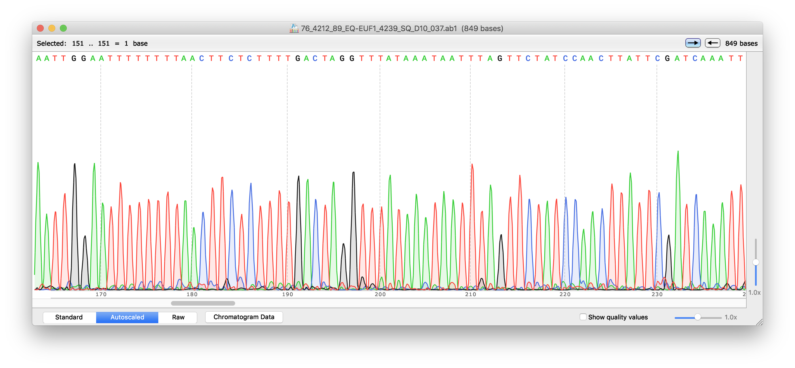
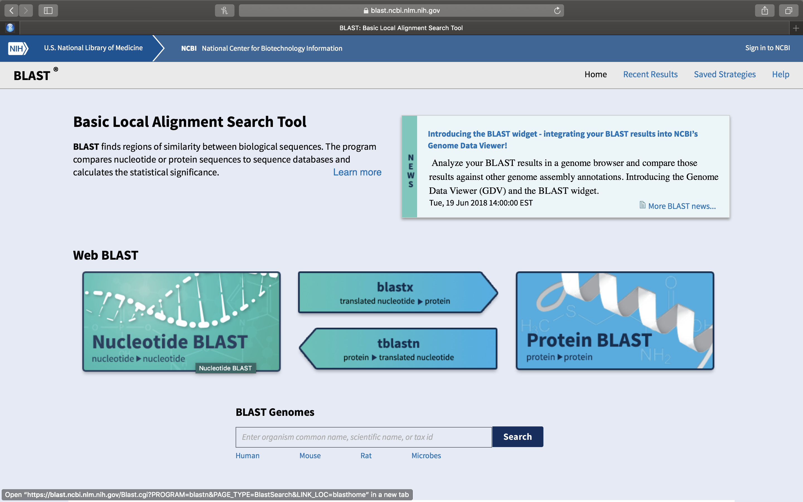

# DNA sequence analysis

In this laboratory session, we will analyze the DNA sequence data from our cloned GAPDH genes generated by the DNA sequencing facility. We will learn how to use various offline and online bioinformatics software tools. [Bioinformatics](https://en.wikipedia.org/wiki/Bioinformatics) is an interdisciplinary field that develops methods and software tools for understanding biological data. As an interdisciplinary field of science, bioinformatics combines biology, computer science, mathematics and statistics to analyze and interpret biological data. Bioinformatics has been used for *in silico* analyses of biological queries using mathematical and statistical techniques.

In the last laboratory session (Chapter \@ref(dna-sequencing)), we set up the DNA sequencing reactions that the laboratory technicians mailed to the sequencing facility. There, DNA sequencing was performed using the chain termination method which was invented by Frederick Sanger and colleauges in the 1970s. This sequencing method is commonly referred to as [Sanger sequencing](https://en.wikipedia.org/wiki/Sanger_sequencing) (Figure \@ref(fig:sanger)). Frederick Sanger received a Nobel Prize for his invention.

```{r sanger, fig.cap='The Sanger (chain-termination) method for DNA sequencing. (1) A primer is annealed to a sequence, (2) Reagents are added to the primer and template, including: DNA polymerase, dNTPs, and a small amount of all four dideoxynucleotides (ddNTPs) labeled with fluorophores. During primer elongation, the random insertion of a ddNTP instead of a dNTP terminates synthesis of the chain because DNA polymerase cannot react with the missing hydroxyl. This produces all possible lengths of chains. (3) The products are separated on a single lane capillary gel, where the resulting bands are read by a imaging system. (4) This produces several hundred thousand nucleotides a day, data which require storage and subsequent computational analysis. By Estevezj [CC BY-SA 3.0](https://creativecommons.org/licenses/by-sa/3.0)], from [Wikimedia Commons.](https://commons.wikimedia.org/wiki/File:Sanger-sequencing.svg)', echo=FALSE, message=FALSE, warning=FALSE}
knitr::include_graphics("./figures/sequencing/sanger.svg")
```

The chain-termination method requires a single-stranded DNA template, a DNA primer, a DNA polymerase, normal deoxynucleosidetriphosphates (dNTPs), and modified di-deoxynucleotidetriphosphates (ddNTPs). These chain-terminating nucleotides lack a 3'-OH group required for the formation of a phosphodiestee bend between two nucleotides. Therefore, the DNA polymerase ceases extension of DNA whenever a modified ddNTP is incorporated. The ddNTPs thus **terminate** the elongation of the newly copied DNA strand. Originally, the ddNTPs were radioactively labelled and four separate sequencing reactions, one for each of the four ddNTPs, had to be set up. Following several rounds of template DNA extension, the resulting DNA fragments were heat denatured and separated by size using gel electrophoresis. Each of the four sequencing reactions was loaded in separate lanes (lanes A, T, G, C). The DNA bands were then visualized by autoradiography. The DNA sequence could be read off the X-ray film by reading from the shortest (at the bottom of the gel) to the longest (at the top of the gel) fragment across the four lanes of the gel.

Since its invention, Sanger sequencing has been improved by several modifications. For example, in cycle sequencing a thermostable DNA polymerase is used. This polymerase can be heated to 95 °C and still retain activity and the sequencing reaction can be repeated multiple times in the same tube by heating the mixture to denature the DNA and then allowing it to cool to anneal the primers and polymerize new strands (similar to PCR). Thus, less DNA is needed than for conventional sequencing reactions. Moreover, today, fluorescently labeled ddNTPs are used. Each ddNTP is labelled with a different fluorescent dye (emitting light at different wavelengths; e.g. blue, green, yellow and red). The labelled DNA fragments are separated using capillary electrophoresis. A laser is used to excite the fluorescence of the labeled ddNTPs and a video camera records the color signal which is digitized and stored on a computer as a digital chromatogram. The chromatogram is analyzed using computer software which generates a graph (also referred to a as a trace) of the intensity of each color against electrophoresis running time resulting in overlapping peaks and troughs of different color. The peaks are used to assign a corresponding sequence letter (A, T, C, G or N in case the software cannot unequivocally decide which base to call). The plotted peak intensities and associated base calls are saved in a seqeuncing data file with the extension ".ab1". Part of a sequencing trace with associated base calls is shown in Fig. \@ref(fig:chromatogram). A base is considered to be of high quality when its identity is unambiguous. A high-quality region of sequence has evenly spaced peaks that do only overlap at their base and has signal intensity in the proper range for the detection software. In today's laboratory session, we will analyze the data files containing the results of our sequencing project. 

```{r chromatogram, fig.cap='DNA sequence chromatogram and base calls viewed with SnapGene software.', echo=FALSE, message=FALSE, warning=FALSE}

```

## Experimental procedures

1. Open a web browser on your computer. If you are reading this in your browser, right click on the highlighted link to open the [SnapGene](http://www.snapgene.com/products/snapgene_viewer/) web site in a new tab. Otherwise enter the link in your browser manually. 
2. Download SnapGene by clicking on the button corresponding to the operating
   system of your computer.
4. Once your download has finished, install the program.
5. After the installation has completed, double click on the program icon and
   start the program.
6. A program window will open. Click on the "Open" icon and navigate to the folder
   where the sequence files are stored on your computer.   
7. Click on the sequence file that ends with ".ab1". Click open.
8. A new window will open showing the sequence chromatogram trace and associated base calls (Figure \@ref(fig:chromatogram)).  
9. Locate two buttons with arrows pointing to the right and left in the top right corner of the SnapGene Viewer window.
10. Click on the left button (arrow points to the right). This will bring you to the 5'-end of the sequence.
11. Click on the right button (arrow points to the left) to go to the 3'-end of the sequence.
12. Look for a number next to the right button. It indicates the length of the sequence.
13. Using your trackpad (or computer mouse) scan slowly from the 5' to the 3' end of the sequence and look at the chromatogram trace.
14. Are the peaks sharp and clearly separated from each other with little overlap?
15. Was the software able to call the bases or are there any (or many) "N" labels above the trace? 

## BLAST search

## Experimental procedures

1. Open a web browser on your computer. If you are reading this in your browser, right click on the highlighted link to open the web site of the [U.S. National Library of Medicine](https://www.nlm.nih.gov) in a new tab (Fig. \@ref(fig:nlm)). Otherwise enter the link in your browser manually. 

(ref:nlm) The web page of the U.S. National Library of Medicine.

```{r , fig.cap='(ref:nlm)', echo=FALSE, message=FALSE, warning=FALSE}
knitr::include_graphics("./figures/bioinformatics/nlm.png")
`````

2. On the U.S. National Library of Medicine web page (Fig. \@ref(fig:nlm)), click on the right most square with the DNA icon and BLAST (Basic Local Alignment Tool) written on it.
3. On the newly opened page (Fig. \@ref(fig:blast)), you will see a row of squares displaying various titles. Click on the left most square that has Nucleotide Blast written on it.

(ref:blast) The Basic Local Alignment Search Tool (BLAST) start page.

```{r blast, fig.cap='(ref:blast)', echo=FALSE, message=FALSE, warning=FALSE}

`````

4. A new page will open. Paste your DNA sequence into the white box on the top left (Fig. \@ref(fig:sequence)). Leave the default values unchanged and click on the oval blue button at the lower left that has BLAST written on it (Fig. \@ref(fig:click)). This will upload your sequence (referred to from now on as the **Query** sequence) to the server where it will be compared to all sequences on record. A new page will open that will be updated every 2 seconds while your query is being processed. Once the search has completed, a new page will open.

(ref:sequence) Nucleotide BLAST (BLASTN) sequence entry form.

```{r sequence, fig.cap='(ref:sequence)', echo=FALSE, message=FALSE, warning=FALSE}
knitr::include_graphics("./figures/bioinformatics/sequence_entry.png")
`````

```{r click, fig.cap='After you have pasted your sequence into the sequence entry field, click the BLAST button at the lower left of the page.', echo=FALSE, message=FALSE, warning=FALSE}
knitr::include_graphics("./figures/bioinformatics/click_blast.png")
`````


5.     
