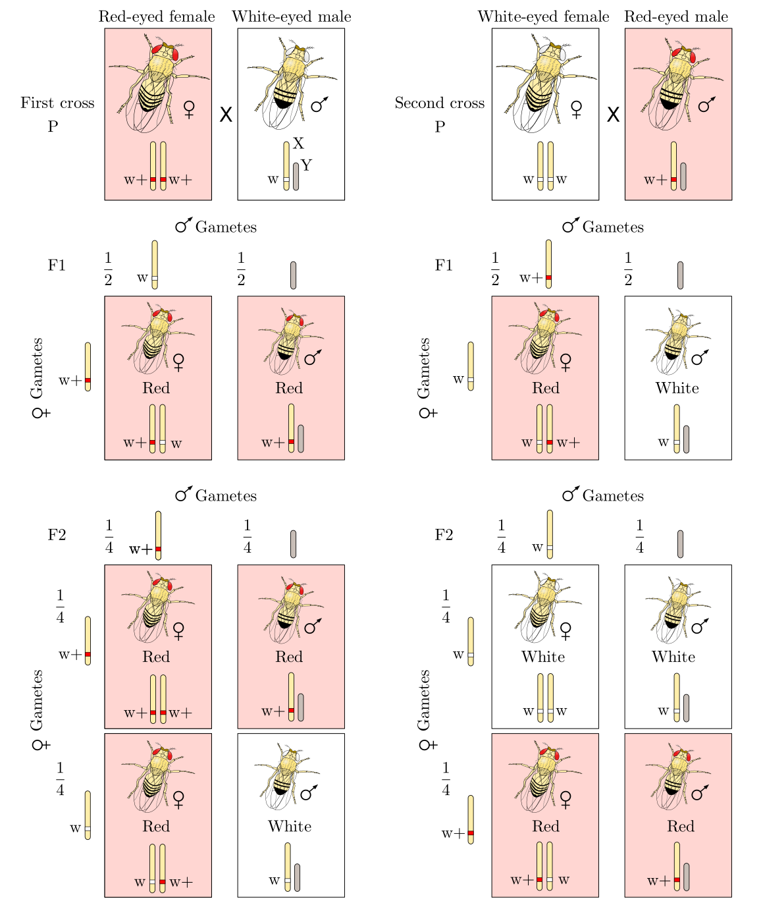

# Genetic Inheritance in Drosophila

## *Drosophila*

[*Drosophila*](https://en.wikipedia.org/wiki/Drosophila) is a genus of flies, belonging to the family Drosophilidae, whose members are often called "small fruit flies" or (less frequently) pomace flies, vinegar flies, or wine flies, a reference to the characteristic of many species to linger around overripe or rotting fruit.The term "*Drosophila*", meaning "dew-loving", is a modern scientific Latin adaptation from Greek words δρόσος, drósos, "dew", and φίλος, phílos, "loving" with the Latin feminine suffix -a.

One species of *Drosophila* in particular, *D. melanogaster*, has been heavily used in research in genetics and is a common model organism in developmental biology. The terms "fruit fly" and "*Drosophila*" are often used synonymously with *D. melanogaster* in modern biological literature. The entire genus, however, contains more than 1,500 species and is very diverse in appearance, behavior, and breeding habitat.

*D. melanogaster* is a popular experimental animal because it is easily cultured en masse out of the wild, has a short generation time, and mutant animals are readily obtainable. In 1906, [Thomas Hunt Morgan](https://en.wikipedia.org/wiki/Thomas_Hunt_Morgan) began his work on *D. melanogaster* and reported his first finding of a [white eyed mutant](https://en.wikipedia.org/wiki/White_(mutation)) in 1910 to the academic community. He was in search of a model organism to study genetic heredity and required a species that could randomly acquire genetic mutation that would visibly manifest as morphological changes in the adult animal. His work on *Drosophila* earned him the 1933 Nobel Prize in Medicine for identifying chromosomes as the vector of inheritance for genes. This and other *Drosophila* species are widely used in studies of genetics, embryogenesis, chronobiology, and other areas.


(ref:redwhite) [Results from reciprocal crosses between red-eyed (Red) and white-eyed (White) Drosophila in Morgan's experiments. w + = red allele (wild-type allele) and w = white (mutant allele). In sex-linked inheritance, alleles on sex chromosomes (XY) are inherited in predictable patterns.](https://commons.wikimedia.org/wiki/File:Sex-linked_inheritance.svg) By GYassineMrabetTalk✉This vector image was created with Inkscape. [GFDL](http://www.gnu.org/copyleft/fdl.html) or [CC BY-SA 3.0](https://creativecommons.org/licenses/by-sa/3.0), from Wikimedia Commons.

```{r redwhite, fig.cap='(ref:redwhite)', echo=FALSE, message=FALSE, warning=FALSE}

```


