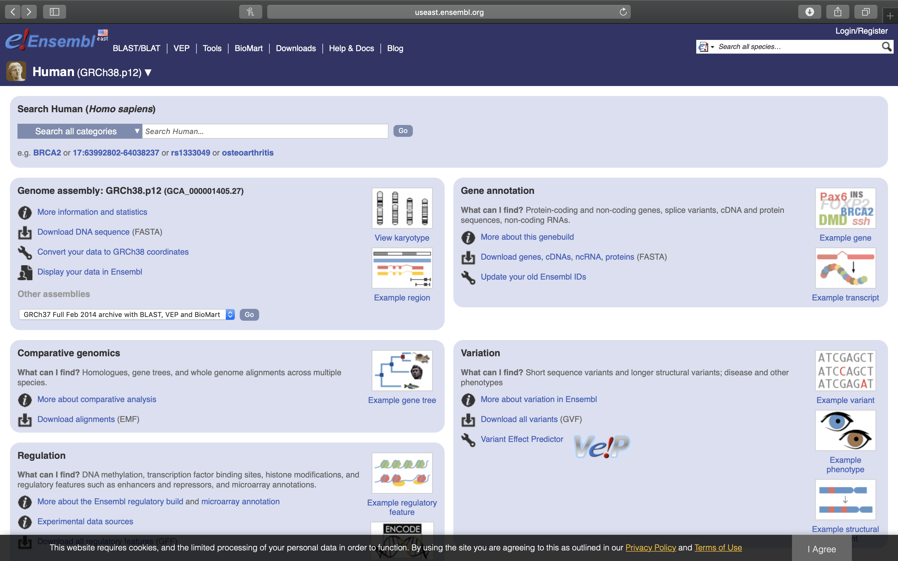

# The Human Genome

In this lab session, we will take a closer look at the human genome and known variations that distinguish different populations and variations that have been linked to increased risk for certain diseases.

The [human genome](https://en.wikipedia.org/wiki/Human_genome) is the complete set of nucleic acid sequences for humans, encoded as DNA within the 23 chromosome pairs in cell nuclei and in a small DNA molecule found within mitochondria. The human genome includes both protein-coding DNA genes and noncoding DNA. The haploid human genome in egg and sperm cells consists of more than three billion DNA base pairs (Table \@ref(tab:chr)), while the diploid genome in somatic cells has twice the DNA content. The Human Genome Project (HGP) produced the first (almost) complete sequence of the human genome, with the first draft sequence and initial analysis being published in 2001.

## The Human Genome Project

The [Human Genome Project](https://en.wikipedia.org/wiki/Human_Genome_Project) was an international scientific research project with the goal of determining the sequence of nucleotide base pairs that make up human DNA, and of identifying and mapping all of the genes of the human genome from both a physical and a functional standpoint. After the idea was picked up in 1984 by the US government when the planning started, the project formally launched in 1990 and was declared complete in 2003. Funding came from the US government through the National Institutes of Health (NIH) as well as numerous other groups from around the world. A parallel project was conducted outside government by the Celera Corporation, or Celera Genomics, which was formally launched in 1998. Most of the government-sponsored sequencing was performed in twenty universities and research centers in the United States, the United Kingdom, Japan, France, Germany, Spain and China.

The Human Genome Project originally aimed to map the nucleotides contained in a human haploid reference genome (more than three billion). The project was not able to sequence all the DNA found in human cells. It sequenced only euchromatic regions of the genome, which make up 92% of the human genome. The other regions, called heterochromatic, are found in centromeres and telomeres, and were not sequenced under the project. An initial rough draft of the human genome was available in June 2000 and by February 2001 a working draft had been completed and published followed by the final sequencing mapping of the human genome on April 14, 2003. Although this was reported to cover 99% of the euchromatic human genome with 99.99% accuracy, a major quality assessment of the human genome sequence was published on May 27, 2004 indicating over 92% of sampling exceeded 99.99% accuracy which was within the intended goal. Further analyses and papers on the HGP continue to occur.

The most recent official version of the human genome sequence is the Dec. 2013 (GRCh38/hg38) assembly of the human genome (hg38, GRCh38 Genome Reference Consortium Human Reference 38 (GCA_000001405.15)). The Dec. 2013 human reference sequence (GRCh38) was produced by the [Genome Reference Consortium](http://www.ncbi.nlm.nih.gov/projects/genome/assembly/grc/).

An assembly is a set of chromosomes, unlocalized and unplaced (random) sequences and alternate loci used to represent an organism's genome. Most current assemblies are a haploid representation of an organism's genome, although some loci may be represented more than once. The human genome reference assembly has been obtained from multiple individuals. The haploid assembly does not represent a single haplotype, but rather a mixture of haplotypes. As sequencing technology evolves, it is anticipated that diploid sequences representing an individual's genome will become available.

A chromosome assembly represents a relatively complete pseudo-molecule assembled from smaller sequences (components) that represent a biological chromosome. Relatively complete implies that some gaps may still be present in the assembly (e.g. there are still gaps in the human genome assembly), but independent measures suggest that most of the sequence is represented by sequenced bases. An unlocalized sequence is a sequence found in an assembly that is associated with a specific chromosome but cannot be ordered or oriented on that chromosome. An unplaced sequence is a sequence found in an assembly that is not associated with any chromosome.

Assemblies are built from components, which in turn are joined to form contigs, which are used to build scaffolds (definitions of these and other relevant terms can be found on the [GRC web site](https://www.ncbi.nlm.nih.gov/grc/help/definitions/#ALTERNATE)).

Table: (\#tab:chr) [Human Genome Assembly GRCh38.p12](https://www.ncbi.nlm.nih.gov/grc/human/data) (Release date: 2017-12-21). Length of DNA sequence of each human chromosome. Total lengths are calculated by summing the length of the sequenced bases and estimated gaps. Ungapped lengths are calculated by summing the length of sequenced bases only. 'Ns' are excluded.

|Chromosome|Total length |Ungapped length| 
|:--------:|------------:|--------------:|
|1	   | 248,956,422 | 231,223,641   | 		
|2	   | 242,193,529 | 240,863,511	 |     
|3	   | 198,295,559 | 198,255,541	 |     
|4	   | 190,214,555 | 189,962,376	 |     
|5	   | 181,538,259 | 181,358,067	 |     
|6	   | 170,805,979 | 170,078,524	 |     
|7	   | 159,345,973 | 158,970,135	 |     
|8	   | 145,138,636 | 144,768,136	 |     
|9	   | 138,394,717 | 122,084,564	 |     
|10	   | 133,797,422 | 133,263,006	 |     
|11	   | 135,086,622 | 134,634,058	 |     
|12	   | 133,275,309 | 133,137,821	 |     
|13	   | 114,364,328 | 97,983,128	 |     
|14	   | 107,043,718 | 91,660,769	 |     
|15	   | 101,991,189 | 85,089,576	 |     
|16	   | 90,338,345  | 83,378,703	 |
|17	   | 83,257,441  | 83,481,871	 |
|18	   | 80,373,285  | 80,089,650	 |
|19	   | 58,617,616  | 58,440,758	 |
|20	   | 64,444,167  | 63,944,268	 |
|21	   | 46,709,983  | 40,088,623	 |
|22	   | 50,818,468  | 40,181,019	 |
|X	   | 156,040,895 | 154,893,034	 |	     
|Y	   | 57,227,415  | 26,452,288	 |
|MT        | 16,569      |               |
|Unplaced  | 4,485,509   | 4,328,403	 |
|Genome    |3,099,734,149| 2,948,611,470 |


Table: (\#tab:gene) Human Genome Assembly GRCh38.p12 (Release date: 2017-12-21). GC content (%) and number of proteins, ribosomal RNA (rRNA), transfer RNA (tRNA), other RNA, genes and pseudogenes on each chromosome. Retrieved on August 10, 2018 at https://www.ncbi.nlm.nih.gov/genome/?term=txid9606[orgn]

|Name  |GC (%) |Protein|rRNA|tRNA|Other RNA|Gene  |Pseudogene|
|:-----|------:|------:|---:|---:|--------:|-----:|---------:|
|Chr 1 |42.3   |11,321 | 17 |90  |4,457    |5,109 |1,386     |
|Chr 2 |40.3   |8,291  | -  |7   |3,728    |3,871 |1,181     |
|Chr 3 |39.7   |7,150  | -  |4   |2,782    |2,990 |900       |
|Chr 4 |38.3   |4,599  | -  |1   |2,193    |2,441 |803       |
|Chr 5 |39.5   |4,729  | -  |17  |2,194    |2,592 |778       |
|Chr 6 |39.6   |5,522  | -  |138 |2,453    |3,005 |882       |
|Chr 7 |40.7   |5,112  | -  |22  |2,330    |2,792 |911       |
|Chr 8 |40.2   |4,199  | -  |4   |2,011    |2,165 |671       |
|Chr 9 |42.3   |4,699  | -  |3   |2,222    |2,270 |706       |
|Chr 10|41.6   |5,429  | -  |3   |2,133    |2,179 |640       |
|Chr 11|41.6   |6,394  | -  |13  |2,336    |2,924 |829       |
|Chr 12|40.8   |5,975  | -  |9   |2,457    |2,526 |691       |
|Chr 13|40.2   |2,056  | -  |4   |1,243    |1,385 |475       |
|Chr 14|42.2   |3,501  | -  |18  |1,704    |2,065 |585       |
|Chr 15|43.4   |3,623  | -  |9   |1,810    |1,824 |554       |
|Chr 16|45.1   |4,625  | -  |27  |1,761    |1,938 |469       |
|Chr 17|45.3   |6,226  | -  |33  |2,243    |2,450 |556       |
|Chr 18|39.8   |2,029  | -  |1   |996      |984   |295       |
|Chr 19|47.9   |6,750  | -  |6   |1,877    |2,499 |523       |
|Chr 20|43.9   |2,904  | -  |-   |1,308    |1,358 |338       |
|Chr 21|42.2   |1,297  | 12 |1   |707      |77    |207       |
|Chr 22|47.7   |2,582  | -  |-   |1,014    |1,189 |354       |
|Chr X |39.6   |3,801  | -  |4   |1,265    |2,186 |875       |
|Chr Y |45.4   |324    | -  |-   |311      |580   |392       |
|MT    |44.4   |13     | 2  |22  |-	       |37    | -        |
|Un    |44.3   |6,143  | 17 |161 |3,437    |6,543 |1,878     |


HGP sc ientists used white blood cells from the blood of two male and two female donors (randomly selected from 20 of each) each donor yielding a separate DNA library. One of these libraries (RP11) was used considerably more than others, due to quality considerations. More than 70% of the reference genome produced by the public HGP came from RP11, a single anonymous male donor from Buffalo, New York (code name RP11).

The "g enome" of any given individual is unique; mapping the "human genome" involved sequencing a small number of individuals and then assembling these together to get a complete sequence for each chromosome. Therefore, the finished human genome is a mosaic, not representing any one individual. In fact, we now know that there is variation in the genomes of individual cells in any one human. The implications of this recent finding for human health will keep scientists busy for a long time.

Annota tion of genes (coding sequences, CDS) is provided by multiple public resources, using different methods, and resulting in information that is similar but not always identical. The [Consensus CDS (CCDS) project](https://www.ncbi.nlm.nih.gov/projects/CCDS/CcdsBrowse.cgi) is a collaborative effort to identify a core set of protein coding regions that are consistently annotated and of high quality and support convergence towards a standard set of gene annotations.

Table: (\#tab:cds) Gene counts based on the [Ensembl human genome annotations](http://useast.ensembl.org/Homo_sapiens/Info/Annotation) of the primary assembly of GRCh38.p12 (Genome Reference Consortium Human Build 38).

|Coding sequence type     | Count                         |
|:------------------------|------------------------------:|
|**Coding genes**         | 20,376 (incl 612 readthrough) |
|**Non coding genes**     | 22,305                        |
|  Small non coding genes | 5,363                         |
|  Long non coding genes  | 14,720 (incl 256 readthrough) |
|  Misc non coding genes  | 2,222                         |
|**Pseudogenes**          | 14,692 (incl 7 readthrough)   |
|**Gene transcripts**     | 203,903                       |


## International HapMap Project

[The International HapMap Project](https://en.wikipedia.org/wiki/International_HapMap_Project) was an organization that aimed to develop a haplotype map (HapMap) of the human genome, to describe the common patterns of human genetic variation. HapMap is used to find genetic variants affecting health, disease and responses to drugs and environmental factors. The information produced by the project was made freely available for research.

Four populations were selected for inclusion in the HapMap: 30 adult-and-both-parents Yoruba trios from Ibadan, Nigeria (YRI), 30 trios of Utah residents of northern and western European ancestry (CEU), 44 unrelated Japanese individuals from Tokyo, Japan (JPT) and 45 unrelated Han Chinese individuals from Beijing, China (CHB). 

All samples were collected through a community engagement process with appropriate informed consent. The community engagement process was designed to identify and attempt to respond to culturally specific concerns and give participating communities input into the informed consent and sample collection processes.

In phase III, 11 global ancestry groups were assembled: ASW (African ancestry in Southwest USA); CEU (Utah residents with Northern and Western European ancestry from the CEPH collection); CHB (Han Chinese in Beijing, China); CHD (Chinese in Metropolitan Denver, Colorado); GIH (Gujarati Indians in Houston, Texas); JPT (Japanese in Tokyo, Japan); LWK (Luhya in Webuye, Kenya); MEX (Mexican ancestry in Los Angeles, California); MKK (Maasai in Kinyawa, Kenya); TSI (Tuscans in Italy); YRI (Yoruba in Ibadan, Nigeria).

The original mission statement of the International HapMap Project was to develop a haplotype map of the human genome, HapMap, which would describe the common patterns of human DNA sequence variation. Through this research millions of SNPs were discovered and many GWAS studies used this dataset in research for disease association. This project was a stepping stone for the 1000 genomes project which utilizes many of the same populations.

## The Single Nucleotide Polymorphism Database (dbSNP) of Nucleotide Sequence Variation

The [Single Nucleotide Polymorphism database](https://www.ncbi.nlm.nih.gov/books/NBK21088/) (dbSNP) is a public-domain archive for a broad collection of simple genetic polymorphisms. This collection of polymorphisms includes single-base nucleotide substitutions (also known as single nucleotide polymorphisms or SNPs), small-scale multi-base deletions or insertions (also called deletion insertion polymorphisms or DIPs), and retroposable element insertions and microsatellite repeat variations (also called short tandem repeats or STRs). Please note that in this chapter, you can substitute any class of variation for the term SNP. Each dbSNP entry includes the sequence context of the polymorphism (i.e., the surrounding sequence), the occurrence frequency of the polymorphism (by population or individual), and the experimental method(s), protocols, and conditions used to assay the variation.

The Reference SNP cluster ID (rsid) is an accession number used to refer to specific SNPs in the database. 

## The 1000 Genomes Project

The [1000 Genomes Project](https://en.wikipedia.org/wiki/1000_Genomes_Project) launched in January 2008, is an international research effort to establish by far the most detailed catalogue of human genetic variation (Table \@ref(tab:thousand)). Scientists planned to sequence the genomes of at least one thousand anonymous participants from a number of different ethnic groups within the following three years, using newly developed technologies which were faster and less expensive. In 2015, two papers in the journal Nature reported results and the completion of the project and opportunities for future research. Many rare variations, restricted to closely related groups, were identified, and eight structural-variation classes were analyzed.

The project unites multidisciplinary research teams from institutes around the world, including China, Italy, Japan, Kenya, Nigeria, Peru, the United Kingdom, and the United States. The team have been contributing to the enormous sequence dataset and to a refined human genome map, which are freely accessible through public databases to the scientific community and the general public alike. The [International Genome Sample Resource](http://www.internationalgenome.org/home) (IGSR) was established at the European Bioinformatics Institute ([EMBL-EBI](https://www.ebi.ac.uk)) in January 2015. The resource was established with three main [aims](http://www.internationalgenome.org/sample_collection_principles), to:

1. Ensure maximal usefulness and relevance of the existing 1000 Genomes data resources
2. Extend the resource for the existing populations
3. Expand the resource to new populations

By providing an overview of all human genetic variation, the consortium has generated a valuable tool for all fields of biological science, especially in the disciplines of genetics, medicine, pharmacology, biochemistry, and bioinformatics.

Table: (\#tab:thousand) Populations represented in the 1000 genomes collection.

|Superpopulation|Description                                                         |Population|Samples|	
|:-------------:|:-------------------------------------------------------------------|:--------:|:-----:|
|AFR	        |African Ancestry in Southwest US	                             |ASW       | 112   |	
|AFR	        |African Caribbean in Barbados	                                     |ACB       | 123   |	
|AFR	        |Esan in Nigeria	                                             |ESN       | 173   |	
|AFR	        |Gambian in Western Division, The Gambia - Fula	                     |GWF       | 100   |
|AFR	        |Gambian in Western Division, The Gambia - Mandinka                  |GWD       | 280   |
|AFR            |Gambian in Western Division, The Gambia - Wolof	             |GWW       | 100   |
|AFR	        |Luhya in Webuye, Kenya	                                             |LWK       | 116   |	
|AFR	        |Mende in Sierra Leone	                                             |MSL       | 128   |	
|AFR	        |Yoruba in Ibadan, Nigeria	                                     |YRI       | 186   |	
|AMR	        |Colombian in Medellin, Colombia	                             |CLM       | 148   |	
|AMR	        |Mexican Ancestry in Los Angeles, California                         |MXL       | 107   |	
|AMR	        |Peruvian in Lima, Peru	                                             |PEL       | 130   |	
|AMR	        |Puerto Rican in Puerto Rico	                                     |PUR       | 150   |	
|EAS	        |Chinese Dai in Xishuangbanna, China	                             |CDX       | 109   |	
|EAS	        |Han Chinese in Beijing, China	                                     |CHB       | 112   |	
|EAS	        |Han Chinese South	                                             |CHS       | 171   |	
|EAS	        |Japanese in Tokyo, Japan	                                     |JPT       | 105   |	
|EAS	        |Kinh in Ho Chi Minh City, Vietnam	                             |KHV       | 124   |	
|EUR	        |British in England and Scotland	                             |GBR       | 107   |	
|EUR	        |Finnish in Finland	                                             |FIN       | 105   |	
|EUR	        |Iberian populations in Spain	                                     |IBS       | 162   |	
|EUR	        |Toscani in Italy	                                             |TSI       | 112   |	
|EUR	        |Utah residents (CEPH) with Northern and Western European ancestry   |CEU       | 183   |	
|SAS	        |Bengali in Bangladesh	                                             |BEB       | 144   |	
|SAS	        |Gujarati Indian in Houston, TX	                                     |GIH       | 113   |	
|SAS	        |Indian Telugu in the UK	                                     |ITU       | 118   |	
|SAS	        |Punjabi in Lahore, Pakistan	                                     |PJL       | 158   |	
|SAS	        |Sri Lankan Tamil in the UK	                                     |STU       | 128   |	


Some basic statistics about the variant sites on the autosomes (chromosomes 1 to 22) and the X chromosome in phase 3 release version 5a from Feb. 20th, 2015 are listed in Table \@ref(tab:stats). The numbering of chromosome	locations is based on [Genome Reference Consortium Human Build 37 patch release 13](https://www.ebi.ac.uk/ena/data/view/GCA_000001405.14) (GRCh37.p13).

Table: (\#tab:stats) The types and numbers of sites with variations in the autosomes and X chromosome in the genomes of 2504 people examined in the 1000 genomes project (phase 3 v5a).

|Type                  |Autosomes|X chromosome|
|:---------------------|--------:|-----------:|
|SNPs	               |78136341 |3246232     |
|indels	               |3135424  |227112      |
|others	               |58671    |2040        |
|multiallelic sites    |416023   |30994       |
|multiallelic SNP sites|259370   |1505        |
|Total                 |81271745 |3468087     |


(ref:pcaplot) Principle component analysis (PCA) of genetic variation in the 1000 genomes project reveals population stratification. PCA is based on 473,964 autosomal variants with a minor allele frequency greater than 10% in 2504 people from 5 superpopulations.

```{r pca, fig.cap='(ref:pcaplot)', fig.asp = 0.8, fig.width = 6, fig.align = "center", echo=FALSE, message=FALSE, warning=FALSE, dev = "cairo_pdf"}

library("tidyverse")
library(printr)        

setwd("~/Dropbox/R/genetics-master")

#options(scipen=100, digits=3)

#Read in the eigenvectors generated by plink
eigenvec <- data.frame(read.table("data/plink.eigenvec", header=FALSE, skip=0, sep=" "))
rownames(eigenvec) <- eigenvec[,2]
eigenvec <- eigenvec[,3:ncol(eigenvec)]

#Read the ethnicity
ethnicity <- as.tibble(read.csv("data/ethnic_id.csv"))
#Read superpopulations
super <- as.tibble(read_csv("data/superpopulations.csv"))

#Combine eigenvec with ethnicity on ID
eigen_tibble <- as.tibble(eigenvec, rownames = "ID")
eigen_tibble <- ethnicity %>% inner_join(eigen_tibble)
pop_vec <- inner_join(eigen_tibble, super)

#Plot first component vs. second
ggplot2::ggplot(data = pop_vec) +
  geom_point(mapping = aes(x = eigenvec[,1], y= eigenvec[,2], color = Superpopulation)) +
  labs(x = "Principle component 1", y = "Principle component 2") +
  theme(axis.text.x=element_text(family="sans"))

#ggplot2::ggplot(data = pop_vec) +
#  geom_point(mapping = aes(x = eigenvec[,1], y= eigenvec[,2], shape = Superpopulation, color = Name))

#ggplot2::ggplot(data = pop_vec) +
#  geom_point(mapping = aes(x = eigenvec[,1], y= eigenvec[,2], shape = as.factor(Gender), color = Name))

#Plot first component vs. third
ggplot2::ggplot(data = pop_vec) +
  geom_point(mapping = aes(x = eigenvec[,1], y= eigenvec[,3], color = Superpopulation)) +
  labs(x = "Principle component 1", y = "Principle component 3") +
  theme(axis.text.x=element_text(family="sans"))

#ggplot2::ggplot(data = pop_vec) +
#  geom_point(mapping = aes(x = eigenvec[,1], y= eigenvec[,3], shape = as.factor(Gender), color = Name))
```

## Viewing The Human Genome

### Experimental Procedures

1. Open a web browser and go to the [Ensemble genome browser](http://useast.ensembl.org/Homo_sapiens/Info/Index) (Fig. \@ref(fig:genomebrowser)). This site provides a data set based on the December 2013 Homo sapiens high coverage assembly GRCh38 from the Genome Reference Consortium.

(ref:genomebrowser) The Ensembl genome browser web page.

```{r ensembl, fig.cap='(ref:genomebrowser)', echo=FALSE, message=FALSE, warning=FALSE}

`````


## Experimental Procedures

1. 

## Review Questions
1. 

