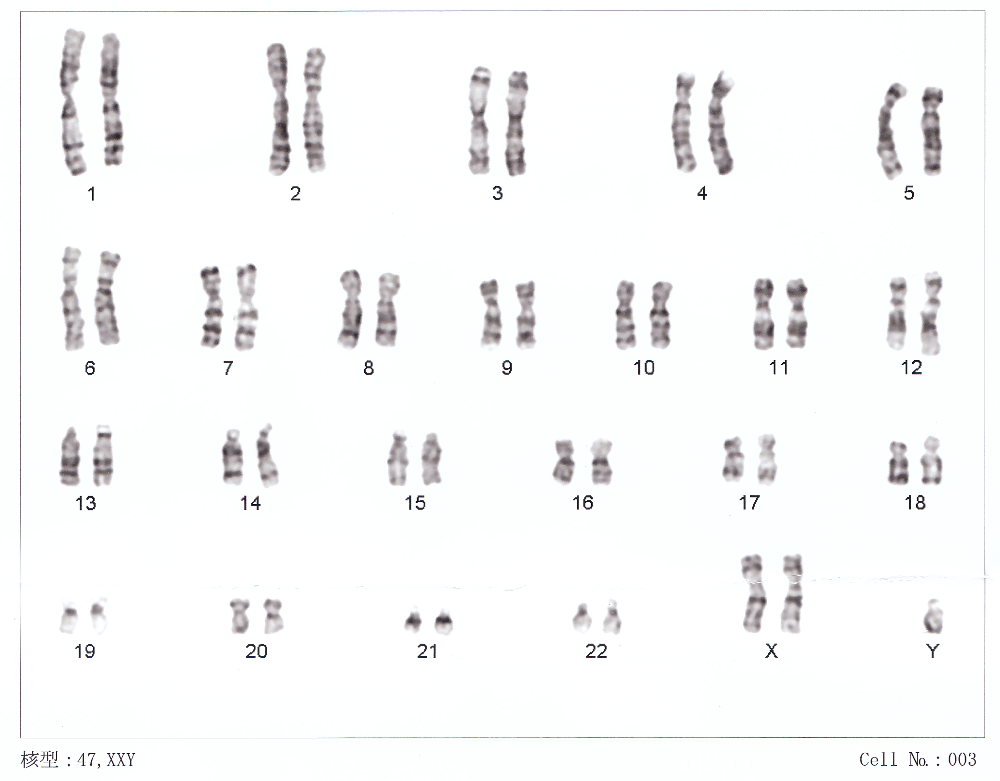

# Determining The Karyotype

As [karyotype](https://en.wikipedia.org/wiki/Karyotype) is the number and appearance of chromosomes in the nucleus of a
eukaryotic cell. The term is also used for the complete set of chromosomes in a
species or in an individual organism and for a test that detects this
complement or measures the number.

Karyotypes describe the chromosome count of an organism and what these chromosomes look like under a light microscope. Attention is paid to their length, the position of the centromeres, banding pattern, any differences between the sex chromosomes, and any other physical characteristics. The preparation and study of karyotypes is part of cytogenetics.

The study of whole sets of chromosomes is sometimes known as karyology. The chromosomes are depicted (by rearranging a photomicrograph) in a standard format known as a karyogram or idiogram: in pairs, ordered by size and position of centromere for chromosomes of the same size as shown in Figure \@ref(fig:karyo).

(ref:karyo)[Karyogram of human male using Giemsa staining](https://commons.wikimedia.org/wiki/File:NHGRI_human_male_karyotype.png)

```{r karyo, fig.cap='(ref:karyo)', echo=FALSE, message=FALSE, warning=FALSE}
knitr::include_graphics("./figures/karyotyping/human_male_karyotype.jpg")
```

The basic number of chromosomes in the somatic cells of an individual or a species is called the somatic number and is designated 2n. In the germ-line (the sex cells) the chromosome number is n (humans: n = 23). Thus, in humans 2n = 46.

So, in normal diploid organisms, autosomal chromosomes are present in two copies. There may, or may not, be sex chromosomes. Polyploid cells have multiple copies of chromosomes and haploid cells have single copies.

The study of karyotypes is important for cell biology and genetics, and the results may be used in evolutionary biology (karyosystematics) and medicine. Karyotypes can be used for many purposes; such as to study chromosomal aberrations, cellular function, taxonomic relationships, and to gather information about past evolutionary events.

Chromosomes were first observed in plant cells by Carl Wilhelm von Nägeli in 1842. Their behavior in animal (salamander) cells was described by Walther Flemming, the discoverer of mitosis, in 1882. The name was coined by another German anatomist, Heinrich von Waldeyer in 1888. It is New Latin from Ancient Greek κάρυον karyon, "kernel", "seed", or "nucleus", and τύπος typos, "general form").

The next stage took place after the development of genetics in the early 20th century, when it was appreciated that chromosomes (that can be observed by karyotype) were the carrier of genes.

Investigation into the human karyotype took many years to settle the most basic question: how many chromosomes does a normal diploid human cell contain? In 1912, Hans von Winiwarter reported 47 chromosomes in spermatogonia and 48 in oogonia, concluding an XX/XO sex determination mechanism. Painter in 1922 was not certain whether the diploid of humans was 46 or 48, at first favoring 46, but revised his opinion from 46 to 48, and he correctly insisted on humans having an XX/XY system. Considering the techniques of the time, these results were remarkable.

In textbooks, the number of human chromosomes remained at 48 for over thirty years. New techniques were needed to correct this error. Joe Hin Tjio working in Albert Levan's lab was responsible for finding the approach:

* Using cells in tissue culture
* Pretreating cells in a hypotonic solution, which swells them and spreads the chromosomes
* Arresting mitosis in metaphase by a solution of colchicine
* Squashing the preparation on the slide forcing the chromosomes into a single plane
* Cutting up a photomicrograph and arranging the result into an indisputable karyogram.

The work took place in 1955, and was published in 1956. The karyotype of humans includes only 46 chromosomes. Rather interestingly, the great apes have 48 chromosomes. Human chromosome 2 is now known to be a result of an end-to-end fusion of two ancestral ape chromosomes.

## Observations on karyotypes
### Staining
The study of karyotypes is made possible by staining. Usually, a suitable dye, such as Giemsa,[19] is applied after cells have been arrested during cell division by a solution of colchicine usually in metaphase or prometaphase when most condensed. In order for the Giemsa stain to adhere correctly, all chromosomal proteins must be digested and removed. For humans, white blood cells are used most frequently because they are easily induced to divide and grow in tissue culture.[20] Sometimes observations may be made on non-dividing (interphase) cells. The sex of an unborn fetus can be determined by observation of interphase cells (see amniotic centesis and Barr body).

### Observations
Six different characteristics of karyotypes are usually observed and compared:

1. Differences in absolute sizes of chromosomes. Chromosomes can vary in absolute size by as much as twenty-fold between genera of the same family. For example, the legumes *Lotus tenuis* and *Vicia faba* each have six pairs of chromosomes, yet *V. faba* chromosomes are many times larger. These differences probably reflect different amounts of DNA duplication.
2. Differences in the position of centromeres. These differences probably came about through translocations.
3. Differences in relative size of chromosomes. These differences probably arose from segmental interchange of unequal lengths.
4. Differences in basic number of chromosomes. These differences could have resulted from successive unequal translocations which removed all the essential genetic material from a chromosome, permitting its loss without penalty to the organism (the dislocation hypothesis) or through fusion. Humans have one pair fewer chromosomes than the great apes. Human chromosome 2 appears to have resulted from the fusion of two ancestral chromosomes, and many of the genes of those two original chromosomes have been translocated to other chromosomes.
5. Differences in number and position of satellites. Satellites are small bodies attached to a chromosome by a thin thread.
6. Differences in degree and distribution of heterochromatic regions. Heterochromatin stains darker than euchromatin. Heterochromatin is packed tighter. Heterochromatin consists mainly of genetically inactive and repetitive DNA sequences as well as containing a larger amount of Adenine-Thymine pairs. Euchromatin is usually under active transcription and stains much lighter as it has less affinity for the giemsa stain. Euchromatin regions contain larger amounts of Guanine-Cytosine pairs. The staining technique using giemsa staining is called G banding and therefore produces the typical "G-Bands".

A full account of a karyotype may therefore include the number, type, shape and banding of the chromosomes, as well as other cytogenetic information.

Variation is often found:

* between the sexes,
* between the germ-line and soma (between gametes and the rest of the body),
* between members of a population (chromosome polymorphism),
in geographic specialization, and
in mosaics or otherwise abnormal individuals.
Human karyotype.

## Human karyotype
The normal human karyotypes contain 22 pairs of autosomal chromosomes and one pair of sex chromosomes (allosomes; Figure \@ref(fig:karyo)). Normal karyotypes for females contain two X chromosomes and are denoted 46,XX; males have both an X and a Y chromosome denoted 46,XY. Any variation from the standard karyotype may lead to developmental abnormalities.

### Ploidy
[Ploidy](https://en.wikipedia.org/wiki/Ploidy) is the number of complete sets of chromosomes in a cell.

### Aneuploidy
[Aneuploidy](https://en.wikipedia.org/wiki/Aneuploidy) is the condition in which the chromosome number in the cells is not the typical number for the species. This would give rise to a chromosome abnormality such as an extra chromosome or one or more chromosomes lost. Abnormalities in chromosome number usually cause a defect in development. [Down syndrome](https://en.wikipedia.org/wiki/Down_syndrome) (Figure \@ref(fig:Down)) and [Turner syndrome](https://en.wikipedia.org/wiki/Turner_syndrome) are examples of this.

## Chromosome abnormalities

Chromosome abnormalities can be numerical, as in the presence of extra or missing chromosomes, or structural, as in derivative chromosome, translocations, inversions, large-scale deletions or duplications. Numerical abnormalities, also known as aneuploidy, often occur as a result of nondisjunction during meiosis in the formation of a gamete; trisomies, in which three copies of a chromosome are present instead of the usual two, are common numerical abnormalities. Structural abnormalities often arise from errors in homologous recombination. Both types of abnormalities can occur in gametes and therefore will be present in all cells of an affected person's body, or they can occur during mitosis and give rise to a genetic mosaic individual who has some normal and some abnormal cells.

### Chromosomal abnormalities that lead to disease in humans include

* Turner syndrome (Figure \@ref(fig:Turner))results from a single X chromosome (45,X or 45,X0).
* [Klinefelter syndrome](https://en.wikipedia.org/wiki/Klinefelter_syndrome) (Figure \@ref(fig:Klinefelter)), the most common male chromosomal disease, otherwise known as 47,XXY, is caused by an extra X chromosome.
* [Edwards syndrome](https://en.wikipedia.org/wiki/Edwards_syndrome) is caused by trisomy (three copies) of chromosome 18.
* Down syndrome (Figure \@ref(fig:Down)), a common chromosomal disease, is caused by trisomy of chromosome 21.
* [Patau syndrome](https://en.wikipedia.org/wiki/Patau_syndrome) is caused by trisomy of chromosome 13.
* [Trisomy 9](https://en.wikipedia.org/wiki/Trisomy_9), believed to be the 4th most common trisomy, has many long lived affected individuals but only in a form other than a full trisomy, such as trisomy 9p syndrome or mosaic trisomy 9. They often function quite well, but tend to have trouble with speech.
* Also documented are trisomy 8 and trisomy 16, although they generally do not survive to birth.

(ref:Turner\)[45,X karyotype, showing an unpaired X at the lower right](https://commons.wikimedia.org/wiki/File:45,X.jpg)
```{r Turner, fig.cap='(ref:Turner)', echo=FALSE, message=FALSE, warning=FALSE}
knitr::include_graphics("./figures/karyotyping/45,X.jpg")
```

(ref:Klinefelter\)[Klinefelter syndrome karyotype (XXY)](https://commons.wikimedia.org/wiki/File:Human_chromosomesXXY01.png)
```{r Klinefelter, fig.cap='(ref:Klinefelter)', echo=FALSE, message=FALSE, warning=FALSE}

```

(ref:Down\)[Karyotype for trisomy Down syndrome: notice the three copies of chromosome 21](https://commons.wikimedia.org/wiki/File:Down_Syndrome_Karyotype.png)
```{r Down, fig.cap='(ref:Down)', echo=FALSE, message=FALSE, warning=FALSE}

```

Some disorders arise from loss of just a piece of one chromosome, including

* [Cri du chat](https://en.wikipedia.org/wiki/Cri_du_chat_syndrome) (cry of the cat), from a truncated short arm on chromosome 5. The name comes from the babies' distinctive cry, caused by abnormal formation of the larynx.
* 1p36 Deletion syndrome, from the loss of part of the short arm of chromosome 1.
* Angelman syndrome – 50% of cases have a segment of the long arm of chromosome 15 missing; a deletion of the maternal genes, example of imprinting disorder.
* Prader-Willi syndrome – 50% of cases have a segment of the long arm of chromosome 15 missing; a deletion of the paternal genes, example of imprinting disorder.
* Chromosomal abnormalities can also occur in cancerous cells of an otherwise genetically normal individual; one well-documented example is the Philadelphia chromosome, a translocation mutation commonly associated with chronic myelogenous leukemia and less often with acute lymphoblastic leukemia.

## Chromosome banding
Chromosomes display a banded pattern when treated with some stains. Bands are alternating light and dark stripes that appear along the lengths of chromosomes. Unique banding patterns are used to identify chromosomes and to diagnose chromosomal aberrations, including chromosome breakage, loss, duplication, translocation or inverted segments. A range of different chromosome treatments produce a range of banding patterns: G-bands, R-bands, C-bands, Q-bands, T-bands and NOR-bands.

Cytogenetics employs several techniques to visualize different aspects of chromosomes.

### Types of banding

* G-banding is obtained with Giemsa stain following digestion of chromosomes with trypsin. It yields a series of lightly and darkly stained bands — the dark regions tend to be heterochromatic, late-replicating and AT rich. The light regions tend to be euchromatic, early-replicating and GC rich. This method will normally produce 300–400 bands in a normal, human genome.
* R-banding is the reverse of G-banding (the R stands for "reverse"). The dark regions are euchromatic (guanine-cytosine rich regions) and the bright regions are heterochromatic (thymine-adenine rich regions).
* C-banding: Giemsa binds to constitutive heterochromatin, so it stains centromeres.The name is derived from centromeric or constitutive heterochromatin. The preparations undergo alkaline denaturation prior to staining leading to an almost complete depurination of the DNA. After washing the probe the remaining DNA is renatured again and stained with Giemsa solution consisting of methylene azure, methylene violet, methylene blue, and eosin. Heterochromatin binds a lot of the dye, while the rest of the chromosomes absorb only little of it. The C-bonding proved to be especially well-suited for the characterization of plant chromosomes.
* Q-banding is a fluorescent pattern obtained using quinacrine for staining. The pattern of bands is very similar to that seen in G-banding.They can be recognized by a yellow fluorescence of differing intensity. Most part of the stained DNA is heterochromatin. Quinacrin (atebrin) binds both regions rich in AT and in GC, but only the AT-quinacrin-complex fluoresces. Since regions rich in AT are more common in heterochromatin than in euchromatin, these regions are labelled preferentially. The different intensities of the single bands mirror the different contents of AT. Other fluorochromes like DAPI or Hoechst 33258 lead also to characteristic, reproducible patterns. Each of them produces its specific pattern. In other words: the properties of the bonds and the specificity of the fluorochromes are not exclusively based on their affinity to regions rich in AT. Rather, the distribution of AT and the association of AT with other molecules like histones, for example, influences the binding properties of the fluorochromes.
* T-banding: visualize telomeres.
Silver staining: Silver nitrate stains the nucleolar organization region-associated protein. This yields a dark region where the silver is deposited, denoting the activity of rRNA genes within the NOR.


### Classic karyotype cytogenetics

In the "classic" (depicted) karyotype, a dye, often Giemsa (G-banding), less frequently mepacrine (quinacrine), is used to stain bands on the chromosomes (Figure \@ref(fig:karyo)). Giemsa is specific for the phosphate groups of DNA. Quinacrine binds to the adenine-thymine-rich regions. Each chromosome has a characteristic banding pattern that helps to identify them; both chromosomes in a pair will have the same banding pattern.

Karyotypes are arranged with the short arm of the chromosome on top, and the long arm on the bottom. Some karyotypes call the short and long arms p and q, respectively. In addition, the differently stained regions and sub-regions are given numerical designations from proximal to distal on the chromosome arms. For example, Cri du chat syndrome involves a deletion on the short arm of chromosome 5. It is written as 46,XX,5p-. The critical region for this syndrome is deletion of p15.2 (the locus on the chromosome), which is written as 46,XX,del(5)(p15.2).

### Multicolor FISH (mFISH) and spectral karyotype (SKY technique)

Multicolor FISH and the older spectral karyotyping are molecular cytogenetic techniques used to simultaneously visualize all the pairs of chromosomes in an organism in different colors (Figure \@ref(fig:sky)). Fluorescently labeled probes for each chromosome are made by labeling chromosome-specific DNA with different fluorophores. Because there are a limited number of spectrally distinct fluorophores, a combinatorial labeling method is used to generate many different colors. Fluorophore combinations are captured and analyzed by a fluorescence microscope using up to 7 narrow-banded fluorescence filters or, in the case of spectral karyotyping, by using an interferometer attached to a fluorescence microscope. In the case of an mFISH image, every combination of fluorochromes from the resulting original images is replaced by a pseudo color in a dedicated image analysis software. Thus, chromosomes or chromosome sections can be visualized and identified, allowing for the analysis of chromosomal rearrangements. In the case of spectral karyotyping, image processing software assigns a pseudo color to each spectrally different combination, allowing the visualization of the individually colored chromosomes. Multicolor FISH is used to identify structural chromosome aberrations in cancer cells and other disease conditions when Giemsa banding or other techniques are not accurate enough.

(ref:sky\)[Spectral human karyotype](https://en.wikipedia.org/wiki/File:Spectralkaryotype98-300.jpg)
```{r sky, fig.cap='(ref:sky)', echo=FALSE, message=FALSE, warning=FALSE}
knitr::include_graphics("./figures/karyotyping/Spectralkaryotype98-300.jpg")
```


## Exercise 1: using graduated (serological) macropipettes
### Experimental procedures
