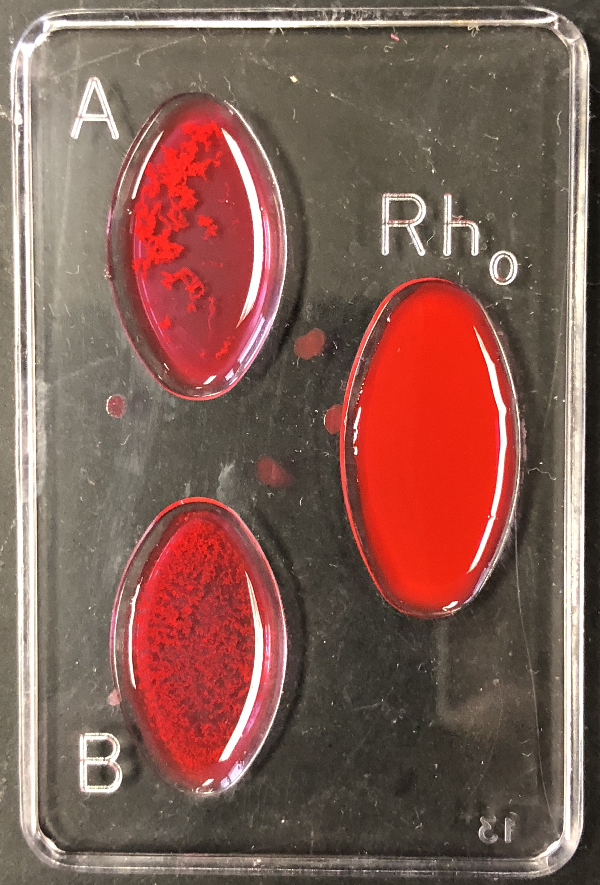

# Mendelian Genetics

In this experiment, we will use maize *Zea mays* subsp. mays, from Spanish: maíz after Taíno mahiz), also known as corn to study [Mendelian inheritance](https://en.wikipedia.org/wiki/Mendelian_inheritance). This cereal grain was first domesticated by indigenous peoples in southern Mexico about 10,000 years ago. The leafy stalk of the plant produces separate pollen and ovuliferous inflorescences or ears, which are fruits, yielding kernels or seeds. Maize has become a staple food in many parts of the world, with total production surpassing that of wheat or rice. However, not all of this maize is consumed directly by humans. Some of the maize production is used for corn ethanol, animal feed and other maize products, such as corn starch and corn syrup. The six major types of corn are dent corn, flint corn, pod corn, popcorn, flour corn, and sweet corn.

The principles of Mendelian inheritance were named for and first derived by [Gregor Johann Mendel](https://en.wikipedia.org/wiki/Gregor_Mendel), a nineteenth-century Moravian monk who formulated his ideas after conducting simple hybridisation experiments with pea plants (*Pisum sativum*) he had planted in the garden of his monastery. Between 1856 and 1863, Mendel cultivated and tested some 5,000 pea plants. From these experiments, he induced two generalizations which later became known as Mendel's Principles of Heredity or Mendelian inheritance (Table \@ref(tab:mendel)). He described these principles in a two-part paper, Versuche über Pflanzen-Hybriden (Experiments on Plant Hybridization), that he read to the Natural History Society of Brno on 8 February and 8 March 1865, and which was published in 1866. Mendel's conclusions were largely ignored by the vast majority of scientists at the time. In 1900, however, his work was "re-discovered" by three European scientists, Hugo de Vries, Carl Correns, and Erich von Tschermak.

Mendel discovered that, when he crossed purebred white flower and purple flower pea plants (the parental or P generation), the result was not a blend. Rather than being a mix of the two, the offspring (known as the F1 generation) was purple-flowered. When Mendel self-fertilized the F1 generation pea plants, he obtained a purple flower to white flower ratio in the F2 generation of 3 to 1. In the first experiment, we will examine the F2 generation resulting from the F1 generation obtained from a parental generation of yellow and purple corn.

He then conceived the idea of heredity units, which he called "factors". Mendel found that there are alternative forms of factors—now called genes—that account for variations in inherited characteristics. For example, the gene for flower color in pea plants exists in two forms, one for purple and the other for white. The alternative "forms" are now called alleles. For each biological trait, an organism inherits two alleles, one from each parent. These alleles may be the same or different. An organism that has two identical alleles for a gene is said to be homozygous for that gene (and is called a homozygote). An organism that has two different alleles for a gene is said be heterozygous for that gene (and is called a heterozygote).

Mendel hypothesized that allele pairs separate randomly, or segregate, from each other during the production of gametes: egg and sperm. Because allele pairs separate during gamete production, a sperm or egg carries only one allele for each inherited trait. When sperm and egg unite at fertilization, each contributes its allele, restoring the paired condition in the offspring. This is called the Law of Segregation. Mendel also found that each pair of alleles segregates independently of the other pairs of alleles during gamete formation. This is known as the Law of Independent Assortment. In the second experiment, we will observe this law exemplified by a dihybrid cross of corn.

The genotype of an individual is made up of the many alleles it possesses. An individual's physical appearance, or phenotype, is determined by its alleles as well as by its environment. The presence of an allele does not mean that the trait will be expressed in the individual that possesses it. If the two alleles of an inherited pair differ (the heterozygous condition), then one determines the organism’s appearance and is called the dominant allele; the other has no noticeable effect on the organism’s appearance and is called the recessive allele. Thus, in the example above the dominant purple flower allele will hide the phenotypic effects of the recessive white flower allele. This is known as the Law of Dominance but it is not a transmission law: it concerns the expression of the genotype. The upper case letters are used to represent dominant alleles whereas the lowercase letters are used to represent recessive alleles.

Table: (\#tab:mendel) Mendel's laws of inheritance.

|Law|Definition|
|:--|:---------|
|Law of segregation|During gamete formation, the alleles for each gene segregate from each other so that each gamete carries only one allele for each gene.|
|Law of independent assortment|Genes for different traits can segregate independently during the formation of gametes.|
|Law of dominance|Some alleles are dominant while others are recessive; an organism with at least one dominant allele will display the effect of the dominant allele.|

## Punnett square
The [Punnett square](https://en.wikipedia.org/wiki/Punnett_square) (Figures \@ref(fig:punnett) and \@ref(fig:punnettF1)) is a visual representation of Mendelian inheritance and used to predict an outcome of a particular cross or breeding experiment. It is named after [Reginald C. Punnett](https://en.wikipedia.org/wiki/Reginald_Punnett), who devised the approach. In our first experiment, both parents are homozygous, one carrying two copies of the dominant allele (R), the other two copies of the recessive (r) allele. Each parent can only make gametes that have either the R (purple) or r (yellow) allele. The Punnett square for the parental cross is shown in Figure \@ref(fig:punnett)

```{r punnett, fig.cap='Punnett square for homozygous cross.', echo=FALSE, message=FALSE, warning=FALSE}
knitr::include_graphics("./figures/mendel/Punnett.svg")
```
The squares containing the single letters represent the possible gametes. The squares with two letters represent the zygotes resulting from the combination of the respective gametes. It can be easily seen that all offspring will be heterozygous (Rr) and therefore purple. The Punnett square for the F1 cross is depicted in Figure \@ref(fig:punnettF1)

```{r punnettF1, fig.cap='Punnett square for heterozygous cross.', echo=FALSE, message=FALSE, warning=FALSE}
knitr::include_graphics("./figures/mendel/PunnettF1.svg")
```

## Monohybrid cross (Experiment 1)
A [monohybrid cross](https://en.wikipedia.org/wiki/Monohybrid_cross) is a mating between two individuals with different variations at one genetic trait of interest. The character(s) being studied in a monohybrid cross are governed by two or multiple variations for a single locus. A cross between two parents possessing a pair of contrasting characters is known as monohybrid cross. To carry out such a cross, each parent is chosen to be homozygous or true breeding for a given trait (locus). When a cross satisfies the conditions for a monohybrid cross, it is usually detected by a characteristic distribution of second-generation (F2) offspring that is sometimes called the monohybrid ratio.

Generally, the monohybrid cross is used to determine the dominance relationship between two alleles. The cross begins with the parental (P) generation. One parent is homozygous for one allele, and the other parent is homozygous for the other allele. The offspring make up the first filial (F1) generation. Every member of the F1 generation is heterozygous and the phenotype of the F1 generation expresses the dominant trait. Crossing two members of the F1 generation produces the second filial (F2) generation. Probability theory predicts that three quarters of the F2 generation will have the dominant allele's phenotype. And the remaining quarter of the F2s will have the recessive allele's phenotype. This predicted 3:1 phenotypic ratio assumes Mendelian inheritance.

In the first experiment, we will study the result obtained from a monohybrid cross. A strain of corn producing pure purple kernels (RR) is crossed with a strain producing pure yellow kernels (rr). Purple is dominant with the resulting F1 ears all bearing purple kernels. These plants that are heterozygous for a single trait are called monohybrids. When the F1 is self-pollinated, the resulting F2 ears bear both purple and yellow kernels (Figure \@ref(fig:monohybrid)).

```{r monohybrid, fig.cap='Monohybrid cross', echo=FALSE, message=FALSE, warning=FALSE}
knitr::include_graphics("./figures/mendel/Monohybrid_cross.jpg")
```

### Experimental procedures
1. Count the number of purple and yellow kernels on one row of the F2 ear without removing the kernels.
2. Determine the ratio of purple to yellow.
3. Now tabulate the numbers obtained by each of your class mates in Table \@ref(tab:mono) and add these figures to get a total.
4. Using the total numbers, determine a ratio of purple to yellow.

Table: (\#tab:mono) Monohybrid cross.

Row #	  |purple   |yellow  |ratio
|:-----:|:-------:|:------:|:----:|
1       |	        |        |      |
2       |	        |        |      |
3       |	        |        |      |
...     |	        |        |      |
7       |	        |        |      |
8       |	        |        |      |
9       |	        |        |      |
Total   |	        |        |      |

## Dihybrid cross (Experiment 2)
In the second experiment, we will study the result obtained from a [dihybrid cross](https://en.wikipedia.org/wiki/Dihybrid_cross). A dihybrid cross is a cross between two different lines (varieties, strains) that differ in two observed traits. In the name "Dihybrid cross", the "di" indicates that there are two traits involved (in our example designated R and Su), the "hybrid" means that each trait has two different alleles (in our example R and r, or Su and su), and "cross" means that there are two individuals who are combining or "crossing" their genetic information. In our example, a pure strain of corn producing purple-starchy kernels (RR SuSu) is crossed with a pure strain producing yellow-sweet (rr susu). The starchy seeds are smooth, the sweet seeds are wrinkled. The resulting F1 ears all bear purple-starchy (smooth) kernels. Plants that are heterozygous for two traits are called dihybrids. When the F1 is self-pollinated, the resulting F2 generation contains various combinations (Figure \@ref(fig:dihybrid)).

```{r dihybrid, fig.cap='Dihybrid cross', echo=FALSE, message=FALSE, warning=FALSE}
knitr::include_graphics("./figures/mendel/Dihybrid_cross.jpg")
```

The rules of meiosis, as they apply to the dihybrid, are codified in Mendel's first law and Mendel's second law, which are also called the Law of Segregation and the Law of Independent Assortment, respectively (Table \@ref(tab:mendel)). For genes on separate chromosomes, each allele pair showed independent segregation. If the first filial generation (F1 generation) produces four identical offspring, the second filial generation, which occurs by crossing the members of the first filial generation, shows a phenotypic (appearance) ratio of **9:3:3:1**, where:

*   the **9** represents the proportion of individuals displaying both dominant traits
*   the first **3** represents the individuals displaying the first dominant trait and the second recessive trait
*   the second **3** represents those displaying the first recessive trait and second dominant trait
*   the **1** represents the homozygous, displaying both recessive traits.

### Experimental procedures
1.  Carefully count the number of kernels of each phenotype appearing on a row of F2 ear. Tabulate the results and determine the totals and total ratios in Table \@ref(tab:di).

Table: (\#tab:di) Dihybrid cross.

Row #  |purple and starchy (smooth)|purple and sweet (wrinkled)|yellow and starchy (smooth)|yellow and sweet (wrinkled)|ratio|
|:----:|---------------------------|---------------------------|---------------------------|---------------------------|-----|
1 	   |			                     |                           |                           |                           |     |
2      |			                     |                           |                           |                           |     |
3      |			                     |                           |                           |                           |     |
...    |			                     |                           |                           |                           |     |
7      |			                     |                           |                           |                           |     |
8      |			                     |                           |                           |                           |     |
9      |			                     |                           |                           |                           |     |
Total  |			                     |                           |                           |                           |     |

## Blood Typing (Experiment 3)
In this experiment, we will determine the ABO properties of four (artificial) blood samples.

(ref:type) Blood type (or blood group) is determined, in part, by the ABO blood group antigens present on red blood cells.

```{r type, fig.cap='(ref:type)', echo=FALSE, message=FALSE, warning=FALSE}

```

A [blood type](https://en.wikipedia.org/wiki/Blood_type) (also called a blood group) ([Figure \@ref(fig:type)](https://commons.wikimedia.org/wiki/File:ABO_blood_type.svg)) is a classification of blood based on the presence and absence of antibodies and also based on the presence or absence of inherited antigenic substances on the surface of red blood cells (RBCs). These antigens may be proteins, carbohydrates, glycoproteins, or glycolipids, depending on the blood group system. Some of these antigens are also present on the surface of other types of cells of various tissues. Blood types are inherited and represent contributions from both parents. A total of 35 human blood group systems are now recognized by the International Society of Blood Transfusion (ISBT). The two most important ones are ABO and the RhD ("Rhesus") antigen; they determine someone's blood type (A, B, AB and O, with +, - or Null denoting RhD status).

### Experimental procedures
1.  Using the dropper vial, place a drop of the first synthetic blood sample in each well of the blood-typing slide (Figure \@ref(fig:typing)). Replace the cap on the dropper vial. Always replace the cap on one vial before opening the next vial, to prevent cross-contamination.
2. Add a drop of synthetic anti-A (blue) to the well labeled A. Replace the cap.
3. Add a drop of synthetic anti-B serum (yellow) to the well labeled B. Replace the cap.
4. Add a drop of synthetic anti-D (Rh) serum (clear) to the well labeled Rh. Replace the cap.
5. Using a mixing stick of a different color for each well (blue for anti-A, yellow for anti-B, white for anti-Rh), gently stir the synthetic blood and anti-serum drops for 30 seconds. Remember to discard each mixing stick after a single use to avoid contamination of your samples.
6. Carefully examine the thin films of liquid mixture left behind:
    * If a film remains uniform in appearance, there is no agglutination.
    * If the sample appears granular, agglutination has occurred.
8. Answer yes or no as to whether agglutination occurred in each sample. A positive agglutination reaction indicates the blood type.
7. Record the results for the first blood sample in Table \@ref(tab:blood).
8. Determine the blood type of the sample using the results that you entered in Table \@ref(tab:blood).
8. Thoroughly rinse the blood-typing slide and repeat steps 1 through 7 for synthetic blood samples 2, 3, and 4, recording the results of each test as you go (and rinsing the slide after each sample).

```{r typing, fig.cap='Blood typing result', echo=FALSE, message=FALSE, warning=FALSE}

```

Table: (\#tab:blood) Blood Typing.

|                 |Sample 1 |	Sample 2|	Sample 3|	Sample 4
|-----------------|---------|---------|---------|---------|
Anti-A            |         |         |         |         |
Anti-B            |         |         |         |         |
Anti-D (Rh) + or -|         |         |         |         |
Blood Type        |         |         |         |         |


## Review Questions
1.  What is a gene?
2.  What is an allele?
3.  What are dominant and recessive alleles?
4.  What is the genotype of an organism?
5.  What is a trait?
6.  What is the phenotype of an organism?
7.  What is the genotype of the F1 generation of the monohybrid cross?
8.  What is the phenotype of the F1 generation monohybrid cross?
9.  What are the possible maternal and paternal genotypes of the F1 gametes monohybrid cross?
10. What is the genotype of the parents of the dihybrid cross?
11. What are the phenotypes of the parents of the dihybrid cross?
12. What are the possible genotypes of the parent gametes of the dihybrid cross?
13. What is the genotype of the F1 generation of the dihybrid cross?
14. What is the phenotype of the F1 generation dihybrid cross?
15. What are the possible maternal and paternal genotypes of the F1 gametes dihybrid cross?
