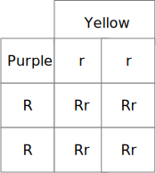

# Mendelian Genetics

## Mendel in His Own Words

The principles of Mendelian inheritance were named for and first derived by [Gregor Johann Mendel](https://en.wikipedia.org/wiki/Gregor_Mendel), a nineteenth-century monk who formulated his ideas after conducting hybridization experiments with [pea plants](https://en.wikipedia.org/wiki/Pea) (*Pisum sativum*) he had planted in the garden of his monastery in [Moravia](https://en.wikipedia.org/wiki/Moravia). Between 1856 and 1863, Mendel cultivated and tested some 5,000 pea plants. From these experiments, he induced two generalizations which later became known as Mendel's Principles of Heredity or Mendelian inheritance (Table \@ref(tab:mendel)). He described these principles in a two-part paper, Versuche über Pflanzen-Hybriden (Experiments on Plant Hybridization), that he read to the Natural History Society of [Brno](https://en.wikipedia.org/wiki/Brno) on 8 February and 8 March 1865, and which was published in 1866. Mendel's conclusions were largely ignored by the vast majority of scientists at the time. In 1900, however, his work was "re-discovered" by three European scientists, [Hugo de Vries](https://en.wikipedia.org/wiki/Hugo_de_Vries), [Carl Correns](https://en.wikipedia.org/wiki/Carl_Correns), and [Erich von Tschermak](https://en.wikipedia.org/wiki/Erich_von_Tschermak).

In this laboratory session, we will read an [English translation](http://www.mendelweb.org/Mendel.html) of [Mendel's famous paper](http://www.mendelweb.org/MWGerText.html). If you prefer to work with a printed copy, you can download a [PDF version of the English translation](papers/bateson-mendel-3-peas.pdf) and print it before coming to the lab.

## Experimental Procedures

1. Right-click on the link to the [English translation](http://www.mendelweb.org/Mendel.html) to open a new browser tab showing an HTML version of Mendel's paper.
2. Read the first section entitled "INTRODUCTORY REMARKS".
3. Notice that some terms are highlighted indicating that they are clickable. Clicking on a link will bring you to a glossary that gives some explanation of the term. You can go back to the main text by clicking on the back button of your browsers.
4. After you have read the "INTRODUCTORY REMARKS", answer the following questions:
    * What is the background of Mendel's experiments?
    * What set Mendel out to do?
    * How long did it take Mendel to conduct the experiments ?
5. Now, read the second section of the paper entitled "SELECTION OF THE EXPERIMENTAL PLANTS".
6. Next, answer the following questions:
    * According to Mendel, what determines whether or not any experiment has any value?
    * What criteria did Mendel use to select the plants for his experiments?
    * Which plants did Mendel choose for his experiments?
    * How many varieties did Mendel obtain originally and how many of those did he select and cultivate for the entire length of his experiments?
    * What is the definition of "species" that Mendel quotes? What does Mendel think of the applicability of this definition in relation to his experiments?
7. Continue and read the section entitled "DIVISION AND ARRANGEMENT OF THE EXPERIMENTS".
8. Answer the following questions:
    * According to Mendel, what was the object(ive) of the experiment?
    * How many differentiating characters did Mendel investigate?
    * How many plants were in total used in these experiments?
    * How many fertilizations were performed in all plants?
    * What is the meaning of "reciprocal crossings"?
9. Read the next section entitled "THE FORMS OF THE HYBRIDS".
10. Answer the following questions:
    * What did Mendel observe when he compared the characters of the hybrids to those of their parents?
    . Which characters did he call dominant? Which did he term recessive?
    * What "interesting" fact about the transmission of the dominant characters from parent to hybrid does Mendel mention in a separate paragraph?
    * List the pairs of dominant and recessive characters observed in these experiments.
11. Continue reading the next section entitled "THE FIRST GENERATION FROM THE HYBRIDS".
12. Answer the following questions:
    * What does Mendel observe in the first generation obtained by crossing the hybrids?
    * What did Mendel **not** observe? Why do you think does he mention and even emphasize a negative observation?
    * How did Mendel quantitatively analyze the data? Which numbers are observed and which number is computed from the observed numbers? According to Mendel, what factors complicated the quantitative analysis and how did Mendel deal with them? 
    * Mendel explains that the observation of a dominant character in the first generation from the hybrids can have a "double signification"? What does he mean and how can the two "significations" be distinguished?
13. Read the next section entitled "THE SECOND GENERATION FROM THE HYBRIDS".
14. Answer the following questions:
    * What is the difference between offspring derived from first generation hybrid parents with dominant characters and offspring derived from first generation parents with recessive characters?
    * What are the quantitative relationships observed?
15. Skip one section and continue reading *the first three paragraphs* of the section entitled "THE OFFSPRING OF HYBRIDS IN WHICH SEVERAL DIFFERENTIATING CHARACTERS ARE ASSOCIATED".
16. Answer the following questions:
    * What was the task Mendel set himself in the experiments described in this section?
    * What experiments did Mendel conduct?  
    * What was the observed outcome of these experiments?

## Mendelian Genetics: A Practical Example

In this set of experiments, we will use maize *Zea mays* subsp. mays, from Spanish: maíz after Taíno mahiz), also known as corn to study [Mendelian inheritance](https://en.wikipedia.org/wiki/Mendelian_inheritance). This cereal grain was first domesticated by indigenous peoples in southern Mexico about 10,000 years ago. The leafy stalk of the plant produces separate pollen and ovuliferous inflorescences or ears, which are fruits, yielding kernels or seeds. Maize has become a staple food in many parts of the world, with total production surpassing that of wheat or rice. However, not all of this maize is consumed directly by humans. Some of the maize production is used for corn ethanol, animal feed and other maize products, such as corn starch and corn syrup. The six major types of corn are dent corn, flint corn, pod corn, popcorn, flour corn, and sweet corn.

## Monohybrid Cross (Experiment 1)
A [monohybrid cross](https://en.wikipedia.org/wiki/Monohybrid_cross) is a mating between two individuals with different variations at one genetic trait of interest. For example, the gene for seed color in corn exists in two forms, one for purple and the other for yellow. These alternative "forms" are called alleles. For each biological trait, an organism inherits two alleles, one from each parent. These alleles may be the same or different. An organism that has two identical alleles for a gene is said to be homozygous for that gene (and is called a homozygote). An organism that has two different alleles for a gene is said be heterozygous for that gene (and is called a heterozygote).

The genotype of an individual is made up of the many alleles it possesses. An individual's physical appearance, or phenotype, is determined by its alleles as well as by its environment. The presence of an allele does not mean that the trait will be expressed in the individual that possesses it. If the two alleles of an inherited pair differ (the heterozygous condition), then one determines the organism’s appearance and is called the dominant allele; the other has no noticeable effect on the organism’s appearance and is called the recessive allele. Thus, in the example above the dominant purple kernel allele (designated R) will hide the phenotypic effects of the recessive yellow kernel allele (designated r). This is known as the Law of Dominance but it is not a transmission law: it concerns the expression of the genotype. Upper case letters are used to represent dominant alleles whereas lowercase letters are used to represent recessive alleles.

The character(s) being studied in a monohybrid cross are governed by two or multiple alleles of a single gene. A cross between two parents possessing a pair of different alleles is known as monohybrid cross. To carry out such a cross, each parent is chosen to be homozygous or true breeding for a given trait (allele). When a cross satisfies the conditions for a monohybrid cross, it is usually detected by a characteristic distribution of second-generation (F2) offspring that is sometimes called the monohybrid ratio.

Generally, the monohybrid cross is used to determine the dominance relationship between two alleles. The cross begins with the parental (P) generation. One parent is homozygous for one allele, and the other parent is homozygous for the other allele. The offspring make up the first filial (F1) generation. Every member of the F1 generation is heterozygous and the phenotype of the F1 generation expresses the dominant trait. Crossing two members of the F1 generation produces the second filial (F2) generation. Probability theory predicts that three quarters of the F2 generation will have the dominant allele's phenotype. And the remaining quarter of the F2s will have the recessive allele's phenotype. This predicted 3:1 phenotypic ratio assumes Mendelian inheritance.

In the first experiment, we will study the result obtained from a monohybrid cross. A strain of corn producing pure purple kernels (RR) is crossed with a strain producing pure yellow kernels (rr). Purple is dominant with the resulting F1 ears all bearing purple kernels. These plants that are heterozygous for a single trait are called monohybrids. When the F1 is self-pollinated, the resulting F2 ears bear both purple and yellow kernels (Figure \@ref(fig:monohybrid)).

## Punnett Square
The [Punnett square](https://en.wikipedia.org/wiki/Punnett_square) (Figures \@ref(fig:punnett) and \@ref(fig:punnettF1)) is a visual representation of Mendelian inheritance and used to predict an outcome of a particular cross or breeding experiment. It is named after [Reginald C. Punnett](https://en.wikipedia.org/wiki/Reginald_Punnett), who devised the approach. In our first experiment, both parents are homozygous, one carrying two copies of the dominant allele (R), the other two copies of the recessive (r) allele. Each parent can only make gametes that have either the R (purple) or r (yellow) allele. The Punnett square for the parental cross is shown in Figure \@ref(fig:punnett)

```{r punnett, fig.cap='Punnett square for homozygous cross.', echo=FALSE, message=FALSE, warning=FALSE}

```
The squares containing the single letters represent the possible gametes. The squares with two letters represent the zygotes resulting from the combination of the respective gametes. It can be easily seen that all offspring will be heterozygous (Rr) and therefore purple. The Punnett square for the F1 cross is depicted in Figure \@ref(fig:punnettF1)

```{r punnettF1, fig.cap='Punnett square for heterozygous cross.', echo=FALSE, message=FALSE, warning=FALSE}
knitr::include_graphics("./figures/mendel/PunnettF1.svg")
```

```{r monohybrid, fig.cap='Monohybrid cross', echo=FALSE, message=FALSE, warning=FALSE}
knitr::include_graphics("./figures/mendel/Monohybrid_cross.jpg")
```

### Experimental Procedures
1. Count the number of purple and yellow kernels on one row of the F2 ear without removing the kernels.
2. Determine the ratio of purple to yellow.
3. Now tabulate the numbers obtained by each of your class mates in Table \@ref(tab:mono) and add these figures to get a total.
4. Using the total numbers, determine a ratio of purple to yellow.

Table: (\#tab:mono) Monohybrid Cross.

|Row #  |purple |yellow |
|:-----:|:-----:|:-----:|
|1      |	|       |
|2      |	|       |
|3      |	|       |
|4      |	|       |
|5      |	|       |
|6      |	|       |
|7      |	|       |
|8      |	|       |
|9      |	|       |
|Total  |	|       |


## Dihybrid Cross (Experiment 2)
In the second experiment, we will study the result obtained from a [dihybrid cross](https://en.wikipedia.org/wiki/Dihybrid_cross). A dihybrid cross is a cross between two different lines (varieties, strains) that differ in two observed traits. In the name "Dihybrid cross", the "di" indicates that there are two traits involved (in our example designated R and Su), the "hybrid" means that each trait has two different alleles (in our example R and r, or Su and su), and "cross" means that there are two individuals who are combining or "crossing" their genetic information. In our example, a pure strain of corn producing purple-starchy kernels (RR SuSu) is crossed with a pure strain producing yellow-sweet (rr susu). The starchy seeds are smooth, the sweet seeds are wrinkled. The resulting F1 ears all bear purple-starchy (smooth) kernels. Plants that are heterozygous for two traits are called dihybrids. When the F1 is self-pollinated, the resulting F2 generation contains various combinations (Figure \@ref(fig:dihybrid)).

```{r dihybrid, fig.cap='Dihybrid cross', echo=FALSE, message=FALSE, warning=FALSE}
knitr::include_graphics("./figures/mendel/Dihybrid_cross.jpg")
```

The rules of meiosis, as they apply to the dihybrid, are codified in Mendel's first law and Mendel's second law, which are also called the Law of Segregation and the Law of Independent Assortment, respectively (Table \@ref(tab:mendel)). For genes on separate chromosomes, each allele pair showed independent segregation. If the first filial generation (F1 generation) produces four identical offspring, the second filial generation, which occurs by crossing the members of the first filial generation, shows a phenotypic (appearance) ratio of **9:3:3:1**, where:

*   the **9** represents the proportion of individuals displaying both dominant traits
*   the first **3** represents the individuals displaying the first dominant trait and the second recessive trait
*   the second **3** represents those displaying the first recessive trait and second dominant trait
*   the **1** represents the homozygous, displaying both recessive traits.

Table: (\#tab:mendel) Mendel's Laws Of Inheritance.

|Law|Definition|
|:--|:---------|
|Law of segregation|During gamete formation, the alleles for each gene segregate from each other so that each gamete carries only one allele for each gene.||
|Law of independent assortment|Genes for different traits can segregate independently during the formation of gametes.|
|Law of dominance|Some alleles are dominant while others are recessive; an organism with at least one dominant allele will display the effect of the dominant allele.||

### Experimental Procedures
1.  Carefully count the number of kernels of each phenotype appearing on a row of F2 ear. Tabulate the results and determine the totals and total ratios in Table \@ref(tab:di).

Table: (\#tab:di) Dihybrid Cross.

|Row # |purple and starchy (smooth)|purple and sweet (wrinkled)|yellow and starchy (smooth)|yellow and sweet (wrinkled)|ratio|
|:----:|---------------------------|---------------------------|---------------------------|---------------------------|-----|
|1     |			   |                           |                           |                           |     |
|2     |			   |                           |                           |                           |     |
|3     |			   |                           |                           |                           |     |
|4     |			   |                           |                           |                           |     |
|5     |			   |                           |                           |                           |     |
|6     |			   |                           |                           |                           |     |
|7     |			   |                           |                           |                           |     |
|9     |	                   |                           |                           |                           |     |
|Total |	                   |                           |                           |                           |     |

## Pearson's Chi-Squared ($\chi^2$) And Goodness Of Fit Test 

Now that we have obtained our data, we can ask how well the Mendelian model of inheritance actually fits our data. We will use Pearson's $\chi^2$ test as a measure of goodness of fit. The [goodness of fit](https://en.wikipedia.org/wiki/Goodness_of_fit) of a statistical model describes how well it fits a set of observations. Measures of goodness of fit typically summarize the discrepancy between observed values and the values expected under the model in question. Pearson's chi-squared test is a statistical test applied to sets of categorical data (like in our case, where we simply observe if a kernel is purple or yellow) to evaluate how likely it is that any observed difference between the sets arose by chance. It tests a null hypothesis stating that the frequency distribution of certain events observed in a sample is consistent with a particular theoretical distribution. The events considered must be mutually exclusive and have total probability 1. In our case, the "events" correspond to observing either purple or yellow kernels. The theoretical distribution of these events is 3:1 (we expect to observe three purple kernels for every yellow one) as predicted by Mendel's laws of inheritance. Chi-squared ($\chi^2$) is the sum of the squared differences between the observed and expected outcome frequencies (that is, counts of observations) divided by the expectation:

$$ \chi^2=\sum\frac{(O_{i}-E_{i})^{2}}{E_{i}} $$

where:

*O~i~* = number (frequency) of observations of type *i*

*E~i~* = expected number (frequency) of observations of type *i* according to the model

In our experiment, *i* is two, since we have two types of observations (purple and yellow). Let's calculate $\chi^2$ using our data first from the monohybrid and then the dihybrid cross.

The $\chi^2$ statistic can be used to calculate a p-value by comparing the value of the statistic to a [chi-squared distribution](https://en.wikipedia.org/wiki/Chi-squared_distribution) with *k* degrees of freedom. The number of degrees of freedom is equal to the number of categories minus 1 (in our case, we have to categories and therefore *k* = 1). The p-value tells us how likely it would be to make the observations that we made, assuming the null hypothesis is true. The null hypothesis in our case is that the ratio of purple to yellow kernels is in fact 3:1. A low p-value, below the chosen significance level, indicates statistical significance, i.e., sufficient evidence to reject the null hypothesis. A significance level of 0.05 is often used as the cutoff between significant and not-significant results.

### Calculating $\chi^2$ Using The Monohybrid Cross Data

1. Add the nubers of observations in each row of the "Purple" column. This number corresponds to *O~purple~*.  
2. Add the numbers of observations in each row of the "Yellow" column. This number corresponds to *O~yellow~*.  
3. Add both numbers. This is the total number of observations.
4. Multiply the total number of observations by 0.75 (the expected fraction of purple kernels). The result is *E~purple~*.
5. Multiply the total number of observations by 0.25 (the expected fraction of yellow kernels). The result is *E~yellow~*.
6. Subtract *E~purple~* from *O~purple~*, square the result and divide by *E~purple~*. The result is $\chi^2_{purple}$.
7. Subtract *E~yellow~* from *O~yellow~*, square the result and divide by *E~yellow~*. The result is $\chi^2_{yellow}$.
8. Obviously, our data do not correspond 100% to the prediction. If they did, $\chi^2$ would be 0. The next step, then, is to see how likely it is that the difference between observation and model are simply due to chance, i.e. due to random errors that can never be competely avoided. 

### Testing Goodness Of Fit

1. State the null hypothesis (*H*~0~). Our *H*~0~ is that kernels with purple color will be 3 times more frequent than kernels with yellow color.
2. Select a desired level of confidence (significance level, p-value or alpha level) for the result of the test. It is common in many scientific investigations to use p < 0.05. This essentially means that we will reject the null hypothesis (*H*~0~), i.e. that our observations are consistent with a 3:1 ratio, if the p-value in our experiments is less than 0.05. In other words, a p-value less than 0.05 would indicate that there is less than a 5% (1 in 20) chance that we would have observed the numbers we did, if the Mendelian model of inheritance is in fact applicable in our case.
3. Determine the p-value corresponding to our $\chi^2$ value. The blue curve shown in Figure \@ref(fig:chisqdist1df) is called the probability density function of $\chi^2$ with one degree of freedom. The light blue shaded area under the curve between $\chi^2=0$ and $\chi^2=3.84$ corresponds to a probability of 95% of observing a $\chi^2$ value in that range if *H*~0~ is true. $\chi^2$ values greater than 3.84 indicate a less than 5% chance of observing the values we did, if *H*~0~ is true (light red shaded area). 
4. Reject *H*~0~ if $\chi^2$ is greater than 3.84.

(ref:chisqdist1df) $\chi^2$ probability density function for one degree of freedom.

```{r chisqdist1df, fig.cap='(ref:chisqdist1df)', out.width='75%', echo=FALSE, message=FALSE, warning=FALSE}
library(tidyverse)
library(printr)        
setwd("~/Dropbox/R/genetics-master")
#function to add p>0.05 area under the curve
funcShaded_1 <- function(x) {
  y <- dchisq(x, df=1)
  y[x >= 3.841459 ] <- NA
  return(y)
}

#function to add p<0.05 area under the curve
funcShaded_2 <- function(x) {
  y <- dchisq(x, df=1)
  y[x < 3.841459 ] <- NA
  return(y)
}

ggplot(data.frame(x = c(0, 10)), aes(x = x)) +
  stat_function(fun = dchisq, args = list(df = 1), aes(color = "k=1"), size = 1, show.legend = FALSE) +
  scale_x_continuous(name = "chi-squared", breaks = seq(0, 10, 0.5)) +
  scale_y_continuous(name = "f(x)") +
  scale_colour_manual("Degrees of freedom", values = "blue") +
  stat_function(fun=funcShaded_1, geom="area", fill="blue", alpha=0.2)  +
  stat_function(fun=funcShaded_2, geom="area", fill="red", alpha=0.2) 
```


### Calculate $\chi^2$ For Your Dihybrid Cross Data

1. Calculate the $\chi^2$ value for your dihybrid cross data.
1. State the null hypothesis (*H*~0~). 
2. Select p < 0.05 as your level of confidence, i. e. you will reject the null hypothesis (*H*~0~) if the p-value in your experiment is less than 0.05. The blue curve shown in Figure \@ref(fig:chisqdist3df) is the probability density function of $\chi^2$ with three degrees of freedom. The light blue shaded area under the curve between $\chi^2=0$ and $\chi^2=7.81$ corresponds to a probability of 95% of observing a $\chi^2$ value in that range if *H*~0~ is true. $\chi^2$ values greater than 7.81 indicate a less than 5% chance of observing the values we did, if *H*~0~ is true (light red shaded area). 
4. Reject *H*~0~ if $\chi^2$ is greater than 7.81.
2. Calculate the goodness of fit of your data to the outcome predicted by Mendel's laws of inheritance applied to a dihybrid cross.
3. What is the p-value corresponding to your $\chi^2$ value?
4. Do you accept or reject your null hypothesis?


```{r chisqdist3df, fig.cap='(ref:chisqdist3df)', out.width='75%', echo=FALSE, message=FALSE, warning=FALSE}
library(tidyverse)
library(printr)        
setwd("~/Dropbox/R/genetics-master")
#function to add p>0.05 area under the curve
funcShaded_3 <- function(x) {
  y <- dchisq(x, df=3)
  y[x > 7.814728 ] <- NA
  return(y)
}

funcShaded_4 <- function(x) {
  y <- dchisq(x, df=3)
  y[x < 7.814728 ] <- NA
  return(y)
}

# Chi-squared for 3 degree of freedom
ggplot(data.frame(x = c(0, 10)), aes(x = x)) +
 # stat_function(fun = dchisq, args = list(df = 1), aes(color = "k=1"), size = 1, show.legend = FALSE) +
    stat_function(fun = dchisq, args = list(df = 3), aes(color = "k=3"), size = 1, show.legend = FALSE) +
  scale_x_continuous(name = "chi-squared", breaks = seq(0, 10, 0.5)) +
  scale_y_continuous(name = "f(x)") +
  scale_colour_manual("Degrees of freedom", values = c("blue", "red")) +
  # theme(axis.line = element_line(size=1, colour = "black"),
  #       panel.grid.major = element_blank(),
  #       panel.grid.minor = element_blank(),
  #       panel.border = element_blank(),
  #       panel.background = element_blank(),
  #       plot.title=element_text(size = 20, family="xkcd-Regular"),
  #       text=element_text(size = 16, family="xkcd-Regular"),
  #       axis.text.x=element_text(colour="black", size = 12),
  #       axis.text.y=element_text(colour="black", size = 12)) +
  # stat_function(fun=funcShaded_1, geom="area", fill="blue", alpha=0.2)  +
  stat_function(fun=funcShaded_3, geom="area", fill="blue", alpha=0.2)  +
  stat_function(fun=funcShaded_4, geom="area", fill="red", alpha=0.2)
```

(ref:chisqdist3df) $\chi^2$ probability density function for three degrees of freedom.

## A Look At Mendel's Monohybrid Cross Data

(ref:mendelresults) Results of Mendel's monohybrid cross experiments with peas.

```{r mendelfigure, fig.cap='(ref:mendelresults)', fig.asp = 0.8, fig.width = 6, fig.align = "center", echo=FALSE, message=FALSE, warning=FALSE, dev = "cairo_pdf"}
library(tidyverse)
library(printr)        
setwd("~/Dropbox/R/genetics-master")

mendel_data <-  as.tibble(read.csv("data/mendel_monohybrid_cross.csv"))

mendel_data$forms <- factor(mendel_data$forms, levels = mendel_data$forms)
mendel_data$differentiating_character <- factor(mendel_data$differentiating_character, levels = unique(mendel_data$differentiating_character))

ggplot(data=mendel_data) +
  geom_col(mapping = aes(x = differentiating_character, y=counts, fill = forms),
           show.legend = TRUE, position = "stack") +
           scale_fill_discrete(name = "Forms") +
           labs(y = "Counts", x = "Differentiating Characters") +
           theme(axis.text.x=element_text(angle=60, hjust=1, family="sans"))
```

Compare your $\chi^2$ and p-values with Mendel's results (Fig. \@ref(fig:mendelfigure)) from his monohybrid cross experiments in peas (Chapter \@ref(mendelian-genetics-mendel-in-his-own-words)). Table \@ref(tab:mendeldata) summarizes the experimental results and Table \@ref(tab:mendelchisq) lists the calculated $\chi^2$ and p-values. 

```{r mendeldata, out.width='75%', echo=FALSE, message=FALSE, warning=FALSE}
library(tidyverse)
library(printr)        
setwd("~/Dropbox/R/genetics-master")

# Mono hybrid cross Mendel data-------------------------------------------------------

mendel_data <-  as.tibble(read.csv("data/mendel_monohybrid_cross.csv"))

knitr::kable(mendel_data, digits = 2, caption = "Mendel's monohybrid cross data for Pearson's chi-squared test.")
```


```{r mendelchisq, out.width='75%', echo=FALSE, message=FALSE, warning=FALSE}
library(tidyverse)
library(printr)        
setwd("~/Dropbox/R/genetics-master")

mendel_data <-  as.tibble(read.csv("data/mendel_monohybrid_cross.csv"))

observed_dom <- mendel_data %>% filter(character == "dominant") %>% select(counts)
observed_rec <- mendel_data %>% filter(character == "recessive") %>% select(counts)
observed_total <- mendel_data %>% group_by(experiment) %>% summarise(total = (sum(counts)))

expected_dom <- as.tibble(observed_total$total * 0.75)
expected_rec <- as.tibble(observed_total$total * 0.25)


chi_squared <- (observed_dom-expected_dom)^2/expected_dom +
                (observed_rec-expected_rec)^2/expected_rec
colnames(chi_squared) <- "chisquared"


#transform the tibble of chi_squared values into a vector
vec <- pull(chi_squared, chisquared)

p_value_for_each_experiment <- 1-pchisq(vec,1)
p_value_all_experiments <- 1-pchisq(sum(vec),7)

mendel_chisqu <- cbind(unique(mendel_data$experiment), chi_squared ,p_value_for_each_experiment)
colnames(mendel_chisqu) <- c("Experiment", "chi_squared", "p-value")

knitr::kable(mendel_chisqu, digits = 2, caption = "Pearson's chi-squared test results for Mendel's monohybrid cross data.")
```

## Review Questions
2.  What is an allele?
3.  What are dominant and recessive alleles?
4.  What is the genotype of an organism?
5.  What is a trait?
6.  What is the phenotype of an organism?
7.  What is the genotype of the F1 generation of the monohybrid cross?
8.  What is the phenotype of the F1 generation monohybrid cross?
9.  What are the possible maternal and paternal genotypes of the F1 gametes monohybrid cross?
10. What is the genotype of the parents of the dihybrid cross?
11. What are the phenotypes of the parents of the dihybrid cross?
12. What are the possible genotypes of the parent gametes of the dihybrid cross?
13. What is the genotype of the F1 generation of the dihybrid cross?
14. What is the phenotype of the F1 generation dihybrid cross?
15. What are the possible maternal and paternal genotypes of the F1 gametes dihybrid cross?
