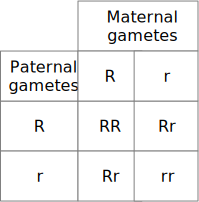

# Mendelian Genetics: Mendel in His Own Words

The principles of Mendelian inheritance were named for and first derived by [Gregor Johann Mendel](https://en.wikipedia.org/wiki/Gregor_Mendel), a nineteenth-century monk who formulated his ideas after conducting simple hybridization experiments with pea plants (*Pisum sativum*) he had planted in the garden of his monastery in [Moravia](https://en.wikipedia.org/wiki/Moravia). Between 1856 and 1863, Mendel cultivated and tested some 5,000 pea plants. From these experiments, he induced two generalizations which later became known as Mendel's Principles of Heredity or Mendelian inheritance (Table \@ref(tab:mendel)). He described these principles in a two-part paper, Versuche über Pflanzen-Hybriden (Experiments on Plant Hybridization), that he read to the Natural History Society of Brno on 8 February and 8 March 1865, and which was published in 1866. Mendel's conclusions were largely ignored by the vast majority of scientists at the time. In 1900, however, his work was "re-discovered" by three European scientists, Hugo de Vries, Carl Correns, and Erich von Tschermak.

In this laboratory session, we will critically read an [English translation] (http://www.mendelweb.org/Mendel.html) of [Mendel's famous paper](http://www.mendelweb.org/MWGerText.html). If you prefer to work with a printed copy, you can download a [PDF version of the paper](papers/bateson-mendel-3-peas.pdf) and print it before coming to the lab.

## Experimental Procedures

1. Right-click on the link to the [English translation] (http://www.mendelweb.org/Mendel.html) to open a new browser tab showing an HTML version of Mendel's paper.
2. Read the first section entitled "Introductory Remarks".
3. Notice that some terms are highlighted indicating that they are clickable. Clicking on a link will bring you to a glossary that gives some explanation of the term. You can go back to the main text by clicking on the back button of your browsers.
4. After you have read the "INTRODUCTORY REMARKS", answer the following questions:
    * What is the backgroundof Mendel's experiments?
    * What set Mendel out to do?
    * How long did it take Mendel to conduct the experiments ?
5. Now, read the second section of the paper entitled "SELECTION OF THE EXPERIMENTAL PLANTS".
6. Next, answer the following questions:
    * According to Mendel, what determines whether or not any experiment has any value?
    * What criteria did Mendel use to select the plants for his experiments?
    * Which plants did Mendel choose for his experiments?
    * How many varieties did Mendel obtain originally and how many of those did he select and cultivate for the entire length of his experiments?
    * What is the definition of "species" that Mendel quotes? What does Mendel think of the applocability of this definition in relation to his experiments?
7. Continue and read the section entitled "DIVISION AND ARRANGEMENT OF THE EXPERIMENTS".
8. Answer the following questions:
    * According to Mendel, what was the object(ive) of the experiment?
    * How many differentiating characters did Mendel investigate?
    * How many plants were in total used in these experiments?
    * How many fertilizations were performed in all plants?
    * What is the meaning of "reciprocal crossings"?
9. Read the next section entitled "THE FORMS OF THE HYBRIDS".
10. Answer the following questions:
    * What did Mendel observe when he compared the characters of the hybrids to those of their parents?
    . Which characters did he call dominant? Which did he term recessive?
    * What "interesting" fact about the transmission of the dominant characters from parent to hybrid does Mendel mention in a separate paragraph?
    . List the pairs of dominant and recessive characters observed in these experiments.
11. Continue reading the next section entitled "THE FIRST GENERATION FROM THE HYBRIDS".
12. Answer the following questions:
    * What does Mendel observe in the first generation obtained by crossing the hybrids?
    * What did Mendel** *****not*** observe? Why do you think does he mention and even emphasize a negative observation?
    * How did Mendel quantitatively analyze the data? Which nmbers are observed and which number is computed from the observed numbers? According to Mendel, what factors complicated the quantitative analysis and how did Mendel deal with them? 
    * Mendel explains that the observation of a dominant character in the first generation from the hybrids can have a "double signification"? What does he mean and how can the two "significations" be distinguished?
13. Read the next section entitled "THE SECOND GENERATION FROM THE HYBRIDS".
14. Answer the following questions:
    * What is the difference between offspring derived from first generation hybrid parents with dominant characters and offspring derived from first generation parents with recessive characters?
    * What are the quantitative relationships observed?
15. Skip one section and continue reading *the first three paragraphs* of the section entitled "THE OFFSPRING OF HYBRIDS IN WHICH SEVERAL DIFFERENTIATING CHARACTERS ARE ASSOCIATED".
16. Answer the following questions:
    * What was the task Mendel set himself in the experiments described in this section?
    * What experiments did Mendel conduct?  
    * What was the observed oucome of these experiments?


Mendel discovered that, when he crossed purebred white flower and purple flower pea plants (the parental or P generation), the result was not a blend. Rather than being a mix of the two, the offspring (known as the F1 generation) was purple-flowered. When Mendel self-fertilized the F1 generation pea plants, he obtained a purple flower to white flower ratio in the F2 generation of 3 to 1. In the first experiment, we will examine the F2 generation resulting from the F1 generation obtained from a parental generation of yellow and purple corn.

He then conceived the idea of heredity units, which he called "factors". Mendel found that there are alternative forms of factors—now called genes—that account for variations in inherited characteristics. For example, the gene for flower color in pea plants exists in two forms, one for purple and the other for white. The alternative "forms" are now called alleles. For each biological trait, an organism inherits two alleles, one from each parent. These alleles may be the same or different. An organism that has two identical alleles for a gene is said to be homozygous for that gene (and is called a homozygote). An organism that has two different alleles for a gene is said be heterozygous for that gene (and is called a heterozygote).

Mendel hypothesized that allele pairs separate randomly, or segregate, from each other during the production of gametes: egg and sperm. Because allele pairs separate during gamete production, a sperm or egg carries only one allele for each inherited trait. When sperm and egg unite at fertilization, each contributes its allele, restoring the paired condition in the offspring. This is called the Law of Segregation. Mendel also found that each pair of alleles segregates independently of the other pairs of alleles during gamete formation. This is known as the Law of Independent Assortment. In the second experiment, we will observe this law exemplified by a dihybrid cross of corn.

The genotype of an individual is made up of the many alleles it possesses. An individual's physical appearance, or phenotype, is determined by its alleles as well as by its environment. The presence of an allele does not mean that the trait will be expressed in the individual that possesses it. If the two alleles of an inherited pair differ (the heterozygous condition), then one determines the organism’s appearance and is called the dominant allele; the other has no noticeable effect on the organism’s appearance and is called the recessive allele. Thus, in the example above the dominant purple flower allele will hide the phenotypic effects of the recessive white flower allele. This is known as the Law of Dominance but it is not a transmission law: it concerns the expression of the genotype. The upper case letters are used to represent dominant alleles whereas the lowercase letters are used to represent recessive alleles.

Table: (\#tab:mendel) Mendel's Laws Of Inheritance.

|Law|Definition|
|:--|:---------|
|Law of segregation|During gamete formation, the alleles for each gene segregate from each other so that each gamete carries only one allele for each gene.|
|Law of independent assortment|Genes for different traits can segregate independently during the formation of gametes.|
|Law of dominance|Some alleles are dominant while others are recessive; an organism with at least one dominant allele will display the effect of the dominant allele.|

## Punnett Square
The [Punnett square](https://en.wikipedia.org/wiki/Punnett_square) (Figures \@ref(fig:punnett) and \@ref(fig:punnettF1)) is a visual representation of Mendelian inheritance and used to predict an outcome of a particular cross or breeding experiment. It is named after [Reginald C. Punnett](https://en.wikipedia.org/wiki/Reginald_Punnett), who devised the approach. In our first experiment, both parents are homozygous, one carrying two copies of the dominant allele (R), the other two copies of the recessive (r) allele. Each parent can only make gametes that have either the R (purple) or r (yellow) allele. The Punnett square for the parental cross is shown in Figure \@ref(fig:punnett)

```{r punnett, fig.cap='Punnett square for homozygous cross.', echo=FALSE, message=FALSE, warning=FALSE}
knitr::include_graphics("./figures/mendel/Punnett.svg")
```
The squares containing the single letters represent the possible gametes. The squares with two letters represent the zygotes resulting from the combination of the respective gametes. It can be easily seen that all offspring will be heterozygous (Rr) and therefore purple. The Punnett square for the F1 cross is depicted in Figure \@ref(fig:punnettF1)

```{r punnettF1, fig.cap='Punnett square for heterozygous cross.', echo=FALSE, message=FALSE, warning=FALSE}

```

## Test cross

A [test cross](https://en.wikipedia.org/wiki/Test_cross), first introduced by Gregor Mendel, involves the breeding of an individual with a phenotypically recessive individual, in order to determine the zygosity of the former by analyzing proportions of offspring phenotypes. Zygosity can either be heterozygous or homozygous. Those that are heterozygous have one dominant and one recessive allele. Individuals that are homozygous dominant have two dominant alleles, and those that are homozygous recessive have two recessive alleles.

The genotype that an offspring has for each of its genes is determined by the alleles inherited from its parents. The combination of alleles is a result of the maternal and paternal chromosomes contributed from each gamete at fertilization of that offspring. During meiosis in gametes, homologous chromosomes experience genetic recombination and segregate randomly into haploid daughter cells, each with a unique combination of maternally and paternally coded genes. Dominant alleles will override the expression of recessive alleles.

Test crosses are used to test an individual's genotype by crossing it with an individual of a known genotype. Individuals that show the recessive phenotype are known to have a homozygous recessive genotype. Individuals that show the dominant phenotype, however, may either be homozygous dominant or heterozygous. The phenotypically dominant organism is the individual in question in a test cross. The purpose of a test cross is to determine if this individual is homozygous dominant or heterozygous.

Test crosses involve breeding the individual in question with another individual that expresses a recessive version of the same trait. Analyzing the proportions of dominant and recessive offspring determines if the individual in question is homozygous dominant or heterozygous. If all offspring from the test cross display the dominant phenotype, the individual in question is homozygous dominant; if half the offspring display dominant phenotypes and half display recessive phenotypes, then the individual is heterozygous. Since the homozygous recessive individual can only pass on recessive alleles, the alleles the individual in question passes on determine the phenotypes of the offspring.


