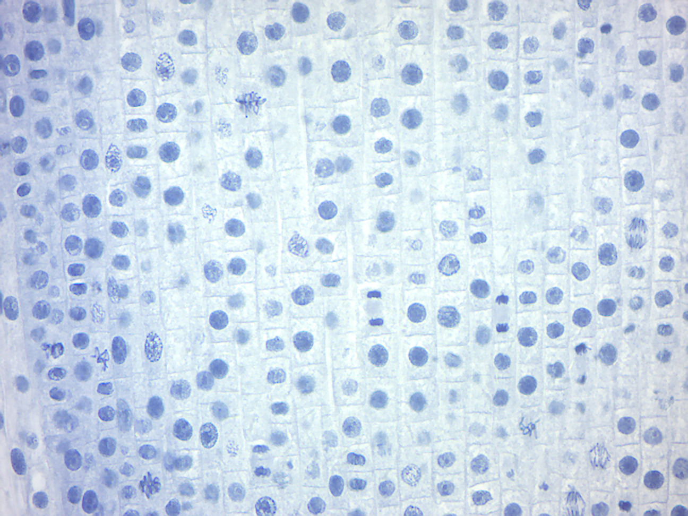
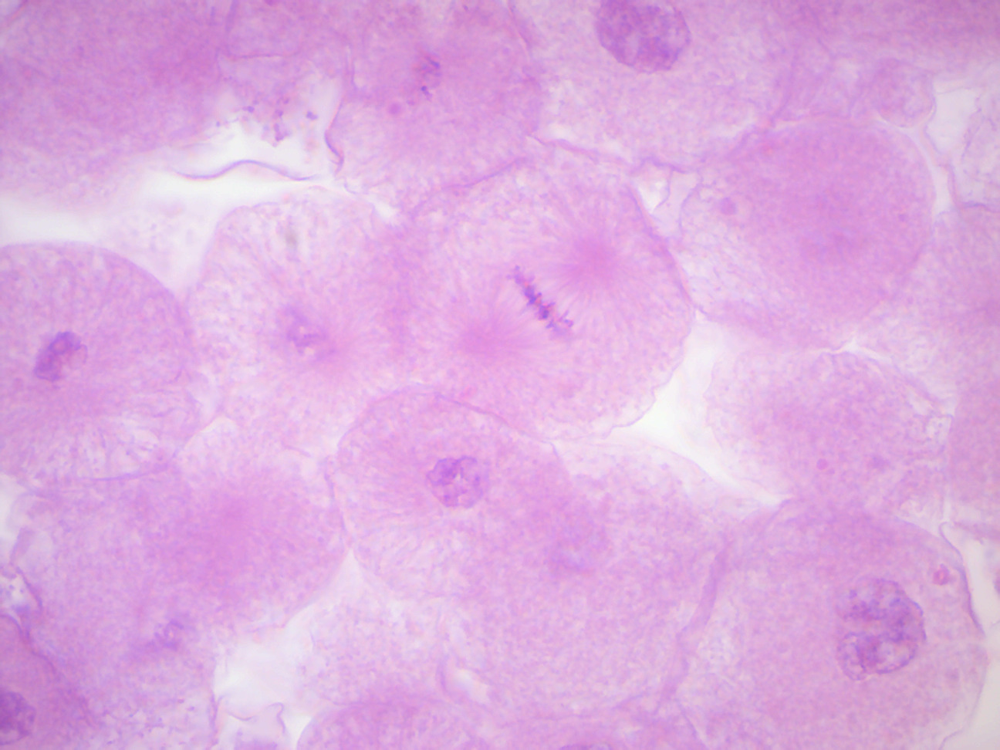

# Mitosis and Meiosis

[Mitosis](https://en.wikipedia.org/wiki/Mitosis) is the part of the cell cycle when replicated chromosomes are separated into two new nuclei. In general, mitosis (division of the nucleus) is preceded by the S stage of interphase (during which the DNA is replicated) and is often accompanied or followed by cytokinesis, which divides the cytoplasm, organelles and cell membrane into two new cells containing roughly equal shares of these cellular components. Mitosis and cytokinesis together define the mitotic (M) phase of an animal cell cycle (the division of the mother cell into two daughter cells genetically identical to each other).
The process of mitosis is divided into stages corresponding to the completion of one set of activities and the start of the next. These stages are prophase, pro-metaphase, metaphase, anaphase, and telophase.

[Meiosis](https://en.wikipedia.org/wiki/Meiosis) is a specialized type of cell division that reduces the chromosome number by half, creating four haploid cells, each genetically distinct from the parent cell that gave rise to them. This process occurs in all sexually reproducing single-celled and multicellular eukaryotes, including animals, plants, and fungi.  Errors in meiosis resulting in aneuploidy are the leading known cause of miscarriage and the most frequent genetic cause of developmental disabilities.
In meiosis, DNA replication is followed by two rounds of cell division to produce four daughter cells, each with half the number of chromosomes as the original parent cell. The two meiotic divisions are known as Meiosis I and Meiosis II. Before meiosis begins, during S phase of the cell cycle, the DNA of each chromosome is replicated so that it consists of two identical sister chromatids, which remain held together through sister chromatid cohesion. This S-phase can be referred to as "premeiotic S-phase" or "meiotic S-phase". Immediately following DNA replication, meiotic cells enter a prolonged G2-like stage known as meiotic prophase. During this time, homologous chromosomes pair with each other and undergo genetic recombination, a programmed process in which DNA is cut and then repaired, which allows them to exchange some of their genetic information. A subset of recombination events results in crossovers, which create physical links known as chiasmata (singular: chiasma, for the Greek letter Chi (X)) between the homologous chromosomes. In most organisms, these links are essential to direct each pair of homologous chromosomes to segregate away from each other during Meiosis I, resulting in two haploid cells that have half the number of chromosomes as the parent cell. During Meiosis II, the cohesion between sister chromatids is released and they segregate from one another, as during mitosis. In some cases, all four of the meiotic products form gametes such as sperm, spores, or pollen. In female animals, three of the four meiotic products are typically eliminated by extrusion into polar bodies, and only one cell develops to produce an ovum.
Because the number of chromosomes is halved during meiosis, gametes can fuse (i.e. fertilization) to form a diploid zygote that contains two copies of each chromosome, one from each parent. Thus, alternating cycles of meiosis and fertilization enable sexual reproduction, with successive generations maintaining the same number of chromosomes. For example, diploid human cells contain 23 pairs of chromosomes including 1 pair of sex chromosomes (46 total), half of maternal origin and half of paternal origin. Meiosis produces haploid gametes (ova or sperm) that contain one set of 23 chromosomes. When two gametes (an egg and a sperm) fuse, the resulting zygote is once again diploid, with the mother and father each contributing 23 chromosomes. This same pattern, but not the same number of chromosomes, occurs in all organisms that utilize meiosis.

## View Prepared Slides
1.	View the onion root tip and observe the different stages of mitosis (Figure \@ref(fig:tip)).

```{r tip, fig.cap='Onion root tip', echo=FALSE, message=FALSE, warning=FALSE}

```

2.	View the fish blastodisc and observe the different stages of mitosis (Figure \@ref(fig:blastodisc)).

```{r blastodisc, fig.cap='Fish blastodisc', echo=FALSE, message=FALSE, warning=FALSE}

```
## Preparing an Onion root tip squash
### Experimental procedures

1.	Obtain an onion bulb that shows some roots.
2.	Cut off a root tip and place it on a clean slide.
3.	Cut off 1mm to 2mm of the root tip and throw away the upper portion of the root.
4.	Cover the root tip with four drops of 1 N HCl and warm the slide over an alcohol burner flame for 1 minute. Do not boil.
5.	Blot off the excess HCl and cover the root tip with 0.5% aqueous toluidine blue.
6.	Again, pass the slide through the alcohol burner flame for 1 minute without boiling.
7.	Blot off the excess stain, add a drop of fresh stain, and apply a coverslip.
8.	Cover the slide with a paper towel and carefully squash the coverslip firmly with your thumb.
9.	Examine the slide for the stages of mitosis as well as interphase and cytokinesis.

```{r spread, fig.cap='Several different phases of mitosis are visible in this onion root tip spread.', echo=FALSE, message=FALSE, warning=FALSE}
knitr::include_graphics("./figures/mitosis/Onion_root_tip_spread.jpg")
```

## Review Questions
1. What is mitosis and what is its outcome?
2. What is meiosis and what is its outrcome?
3. What is homologous recombination and what is its outcome?
4. What do the terms haploid and diploid mean?
5. Are you a haploid or a diploid organism?
6. What are gametes?
7. What is a zygote?
