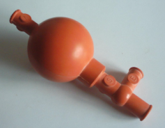
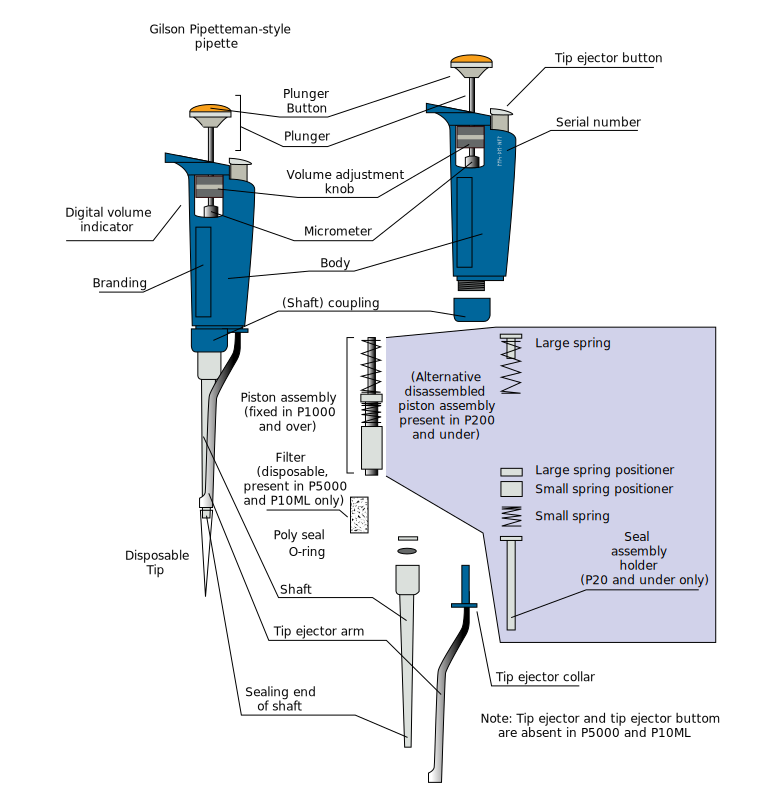

# Molecular Laboratory Skills

In this laboratory you will learn how to handle small amounts of liquids using pipettes. A [pipette](https://en.wikipedia.org/wiki/Pipette) is a laboratory tool commonly used in biology, chemistry, and medicine to draw up, transport and dispense a measured volume of liquid. Pipettes come in several designs for various purposes with differing levels of accuracy and precision, from single piece glass pipettes to more complex adjustable or electronic pipettes. Micropipettes are used to handle small (1 - 1000 µL) or even very small (< 1 µL) amounts of liquids. Macropipettes are used to handle larger volumes. Accurate pipetting is crucial to the success of molecular and biochemical experiments. Mistakes during pipetting may cause experiments to fail or to make them irreproducible.

Commonly, we will use two main types of pipettes:

*   graduated pipettes
*   air displacement micropipettes

[Graduated pipettes](https://en.wikipedia.org/wiki/Graduated_pipette) or serological pipettes are a type macropipette made of glass or plastic consisting of a long tube with a series of graduations, as on a graduated cylinder or burette, to indicate different calibrated volumes. Today we use manual (e.g. a rubber bulb (Figure \@ref(fig:bulb))) or automatic propipetters to generate negative or positive pressure to draw up and dispense the liquids.

(ref:bulb) [A rubber bulb propipetter.](https://commons.wikimedia.org/wiki/File:Pipetteerballon.png)

```{r bulb, fig.cap='(ref:bulb)', echo=FALSE, message=FALSE, warning=FALSE}

```

[Air displacement micropipettes](https://en.wikipedia.org/wiki/Air_displacement_pipette) are a type of adjustable micropipette that deliver a measured volume of liquid; depending on size, it could be between about 0.1 µL to 1000 µL (1 ml). These pipettes require disposable tips that come in contact with the fluid. Micropipettes (also referred to as pipettors) come in several standard sizes with disposable plastic tips that are labeled in different colors (Table \@ref(tab:standard)).

Table: (\#tab:standard) Standard micropipette volumes and colors.

|Name  |Min. volume (µL) |Max. volume (µL) |Color | tip size (µL)|
|:-----|:----------------|:----------------|:-----|:-------------|
|P2    |	0.2      |     2           |white |10            |
|P10   |	1        |     10	   |white |10            |
|P20   |	2	 |     20          |yellow|200           |
|P100  |	20	 |     100         |yellow|200           |
|P200  |	50	 |     200         |yellow|200           |
|P1000 |	200	 |     1000        |blue  |1000          |
|P5000 |	1000     |     5000        |green |5000          |
|P10000|	1000     |     10000       |red	  |10000         |

These pipettes operate by piston-driven air displacement (Figure \@ref(fig:micropipette)) . A vacuum is generated by the vertical travel of a metal or ceramic piston within an airtight sleeve. As the piston moves upward, driven by the depression of the plunger, a vacuum is created in the space left vacant by the piston. The liquid around the tip moves into this vacuum (along with the air in the tip) and can then be transported and released as necessary. These pipettes are capable of being very precise and accurate. However, since they rely on air displacement, they are subject to inaccuracies caused by the changing environment, particularly temperature and user technique. For these reasons this equipment must be carefully maintained and calibrated, and users must be trained to exercise correct and consistent technique.

(ref:micropipette) Schematic of an air displacement pipette. The "Digital volume indicator" is a dial display that indicates the digits (i.e. unrelated to electronic). The components vary between brands and different volume sizes have different components, for example the piston in a P2 is needle-like and can be separated with ease from the piston assembly whereas in a P10 it is drum-like and over 1 cm in diameter and is enclosed in plastic. By Squidonius [CC BY-SA 3.0] (https://creativecommons.org/licenses/by-sa/3.0), from Wikimedia Commons.

```{r micropipette, fig.cap='(ref:micropipette)', echo=FALSE, message=FALSE, warning=FALSE}

```

```{block2, type='rmdnote'}

**The recommendation is for using a pipette whose size is nearest to the volume being worked with.**
```

All adjustable pipettes should be calibrated and checked periodically. The simplest way to accomplish this is to pipette a specific volume of a solution with a known density (remember $density = \frac{mass\ (g)}{volume (ml)}$. The density of distilled water is 1.0 g/ml. Therefore, the accuracy of the pipette or your pipetting skills (if you use an already calibrated pipette as in these experiments) can be checked by determining the mass of a specific volume of water using an analytical balance. We will use this technique in the following two pipetting exercises.

## Exercise 1: using graduated (serological) macropipettes
### Experimental procedures

1.  Obtain a small beaker and fill it with distilled water.
1.  Obtain a weigh boat.
1.  Turn on the microbalance.
1.  Put the empty weigh boat on the microbalance and and set the scale to zero.
1.  Obtain a graduated pipette.
2.  Notice that the  tapered delivery tip at one end of the pipette.
3.  Always hold the pipette upright and straight.
3.  Remove the pipette from the plastic wrapper by pulling apart the wrapper at the top (blunt) end of the pipette.
4.  Attach the rubber bulb or mechanical pipetter to the other (blunt) end of the pipette.
5. Dip the pipette into the water in the small beaker. Don't touch the bottom of the beaker.
6. Draw up the water until the meniscus reaches the position on the scale printed on the pipette corresponding to the desired volume.
7. Dispense the water into a weigh boat.
8. Determine the mass of the dispensed water and record your result in Table \@ref(tab:graduated).
9. Empty the weigh boat, put it on the balance and set the balance to zero again.
10. Repeat this procedure twice for each pipette size and volume listed in Table \@ref(tab:graduated). 
10. After you have completed all measurements, calculate the average for each triplicate set, and the percentage error (relative to the average value) for each set of measurements and enter your results in Table \@ref(tab:graduated).


$$ Error (\%) = \frac{expected\ mass - experimentally\ determined\ mass}{expected\ mass} \times 100\% $$

Your results should be within ±5% of the correct volume set on the dial of the pipette.

Table: (\#tab:graduated) Experimental determination of graduated pipette volumes.

|Name|Volume (ml) |Trial 1|Trial 2|Trial 3|Average|Error (%)  |
|:------|:------|:------|:------|:--------|:------|:----------|
|1 ml   |0.1    |       |       |         |       |           |
|1 ml   |0.5    |       |       |         |       |           |
|1 ml   |1      |       |       |         |       |           |
|5 ml   |0.5    |       |       |         |       |           |
|5 ml   |1      |       |       |         |       |           |
|5 ml   |5      |       |       |         |       |           |
|10 ml  |1      |       |       |         |       |           |
|10 ml  |5      |       |       |         |       |           |
|10 ml  |10     |       |       |         |       |           |
|20 ml  |5      |       |       |         |       |           |
|20 ml  |10     |       |       |         |       |           |
|20 ml  |20     |       |       |         |       |           |

## Exercise 2: using air displacement micropipettes

### Experimental procedures

1. Your laboratory instructor will demonstrate the use of the micropipette before you begin your own experiment.
2. Obtain a micropipette.
3. Identify the main parts of the micropipette (Figure \@ref(fig:micropipette))
    + Plunger button
    + Tip ejector button
    + Volume adjustment dial
    + Digital volume indicator
Shaft
    + Attachment point for a disposable tip
4. Set the pipetting volume. Do not adjust the volume beyond the maximum setting! This will damage the pipettor.
5. Attach a tip to the pipette.
6. Hold the pipette vertically and press the plunger button to the first stop.
7. Dip the tip into the beaker with water and slowly release it, moving the plunger button to the home position.
8. Press the plunger button all the way to the second stop to dispense the sample.
9. Now, carefully draw up and dispense the volumes of distilled water listed in Table \@ref(tab:micro) with the indicated micropipette into the weigh boat. Always keep an eye on the tip and watch the sample: note when it enters the tip and enters the final location. Do not assume some “got in”, especially with small volumes and clear solutions. Remember the approximate levels that particular volumes fill the tip – this will allow you to check your pipetting visually.
10. Record the value of the mass of the dispensed water.
11. Set the balance back to zero.
11. Repeat twice.
12. Eject the tip.
13. After you have completed all measurements, calculate the average for each triplicate set, and the percentage error (relative to the average value) for each set of measurements and enter your results in Table \@ref(tab:micro).

$$ Error (\%) = \frac{expected\ mass - experimentally\ determined\ mass}{expected\ mass} \times 100\% $$

Your results should be within ±5% of the correct volume set on the dial of the pipette.

Table: (\#tab:micro) Experimental determination of micropipette volumes.

|Name|Volume (µL)|Trial 1|Trial 2|Trial 3|Average|Error (%)
|:-----|:------|:------|:-----|:-------|:------|:-------|
P10    |5      |       |       |       |       |
P10    |10     |       |       |       |       |
P20    |5      |       |       |       |       |
P20    |10     |       |       |       |       |
P20    |20     |       |       |       |       |
P200   |20     |       |       |       |       |
P200   |50     |       |       |       |       |
P200   |200    |       |       |       |       |
P1000  |200    |       |       |       |       |
P1000  |500    |       |       |       |       |
P1000  |1000   |       |       |       |       |

(ref:pipetteerror) Graphical representation of the results obtained by the students performing Experiments 1 and 2 in the Genetics course in the spring term 2019.

```{r pipetteerror, fig.cap='(ref:pipetteerror)', out.width='75%', echo=FALSE, message=FALSE, warning=FALSE}

library(tidyverse)
library(printr)
setwd("~/Dropbox/R/genetics-master")

# Load data ---------------------------------------------------------------

data <-  as.tibble(read.csv("data/pipetting.csv"))

# Add error column --------------------------------------------------------

data <- data %>% mutate(error = (actual_volume-target_volume)/target_volume*100, fractional_volume = target_volume/(pipette_size*10^(-3))*100)

# Plot data ---------------------------------------------------------------

# order the pipette names for plotting by pipette size

data$pipette_name <- factor(data$pipette_name, levels = c("1 ml", "5 ml", "10 ml", "20 ml","P10","P20","P200","P1000"))

#Violin plot
ggplot(data = data) +
  geom_violin(mapping = aes(x = pipette_name, y = error, fill = student), 
              draw_quantiles = c(0.25, 0.5, 0.75), 
              adjust = .5, show.legend = TRUE, scale = "width") +
  labs(y = "Error (%)", x = "Pipette size") +
  scale_fill_discrete(name = "Student")
```

Obtain an empty microcentrifuge tube and perform the follwoing pipetting exercises transferring distilled water from a beaker to and from a microcentrifuge tube:

* Use a fresh tip each time.
* Do not touch the tube with the pipette, only with the tip.

* Large volume:
    1. Add 265 µL to a tube
    2. Add 435 µL to the same tube
    3. Remove 615 µL from the tube
    4. Remove 32 µL from the tube
* Small volume:
    1. Add 5.3 µL to a tube
    2. Add 15.5 µL to the same tube
    3. Remove 12.6 µL from the tube
    4. Remove 7.2 µL from the tube
* Very small volume:
    1. Add 1.3 µL
    2. Add 3.8 µL
    3. Remove  4.2 µL
    3. Remove 0.7 µL

1. Hold the pipette almost vertically in the plam of your right hand (if you are right handed).
3. Depress plunger to first stop and hold. Dip tip 2-4 mm into the beaker with distilled water.
4. Gently release the plunger. If you release too quickly, you will create aerosols (small droplets) which will contaminate the pipette.
5. Wait for a second or so and confirm that all the liquid has been taken up.
6. Touch the pipette tip to the inside wall of the beaker to dislodge any remaining droplets adhering to the outside of the tip.
7. Check that there is no air space at the very end of the tip.
6. Put the tube containing the sample in the tube rack and pick up the tube that you want to add the sample to. Hold the tube between your thumb and index finger of your left hand.
8. To expel sample into the tube, touch the tip to wall of the tube and slowly depress the plunger to the first, and then to the second stop to expel the liquid.
9. Keeping the plunger at the second stop, slide the tip out of the fluid, along the tube wall and out of the tube.
10. Look for the small droplet of liquid in the tube to make sure that it was transferred.

## Exercise 3: using a microcentrifuge

A [laboratory centrifuge](https://en.wikipedia.org/wiki/Laboratory_centrifuge) is a piece of laboratory equipment, driven by a motor, which spins liquid samples at high speed to separate heavy materials in a substance from lighter materials in the same substance. The heavier particles will clump at the bottom and form a pellet, while the solution above the pellet is referred to as the supernatant. Centrifuge speeds are measured in RPM (revolutions per minute) or RCF (relative centrifugal force; often referred to as ‘g-force’).

Like all other centrifuges, laboratory centrifuges work by the sedimentation principle, where the centripetal acceleration is used to separate substances of greater and lesser density.

Microcentrifuges sit on the bench top and are used to spin small (2 ml or less) liquid samples at high speeds (up to tens of thousands times g-force). Centrifugation of small samples is important for many biological applications, such as pelleting nucleic acids or proteins from solution. Generally, we also use "microcenfuges" to gather the typically very small volumes of liquids that we work with into the bottom of the tube.

All centrifuges must be balanced or they will be unstable and will not spin at the correct speed. To balance a centrifuge, tubes are symmetrically arranged around the center. An odd number of tubes can be balanced with empty tubes or "balance" tubes filled with water (always label the ALL tubes appropriately). It is a good practice to  tubes always place the tubes in the centrifuge such that the hinges face outward. This way, you will know that the pellet forms directly below the hinge of the microcentrigue tube which helps when the pellet is small and difficult to see.

### Experimental procedures

1. Obtain an empty microcentrifuge tube.
2. Label your tube.
2. Transfer 200 µL of distilled water to the microcentrifuge tube.
5. One by one, put your tubes into the centrifuge with the hinge facing outward.
6. Make sure that the centrifuge is properly balanced.
7. Spin the tubes at 10,000 rpm for 30 seconds.
8. Open the microcentrifuge and remove your tube.
9. Discard your tube and clean up your bench.

## Review Questions

1. What type of pipette do you choose for pipetting small volumes?
2. How do you determine what size pipette to use?
3. Why is it important to balance centrifuges?
4. How do you balance a centrifuge when loading it?
